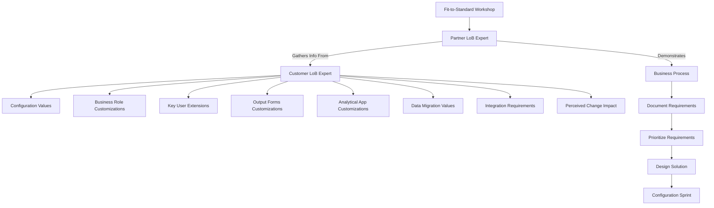

```mermaid
flowchart TB
    A[Fit-to-Standard Workshop] --> B[Partner LoB Expert]
    B -->|Demonstrates| C[Business Process]
    B -->|Gathers Info From| D[Customer LoB Expert]
    
    D --> D1[Configuration Values]
    D --> D2[Business Role Customizations]
    D --> D3[Key User Extensions]
    D --> D4[Output Forms Customizations]
    D --> D5[Analytical App Customizations]
    D --> D6[Data Migration Values]
    D --> D7[Integration Requirements]
    D --> D8[Perceived Change Impact]
    
    C --> E[Document Requirements]
    E --> F[Prioritize Requirements]
    F --> G[Design Solution]
    G --> H[Configuration Sprint]
```
