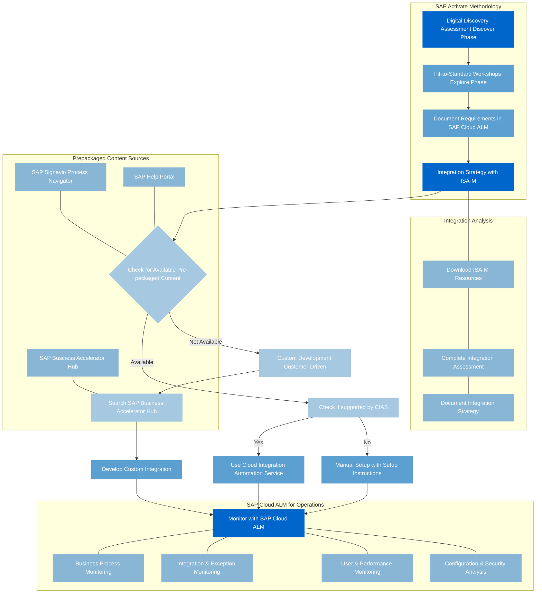

```mermaid
flowchart TB
    subgraph "SAP Activate Methodology"
        A[Digital Discovery Assessment Discover Phase] --> B[Fit-to-Standard Workshops Explore Phase]
        B --> C[Document Requirements in SAP Cloud ALM]
        C --> D[Integration Strategy with ISA-M]
    end
    
    D --> E{Check for Available Pre-packaged Content}
    
    E -->|Available| F[Check if supported by CIAS]
    F -->|Yes| G[Use Cloud Integration Automation Service]
    F -->|No| H[Manual Setup with Setup Instructions]
    
    E -->|Not Available| I[Custom Development Customer-Driven]
    
    I --> J[Search SAP Business Accelerator Hub]
    J --> K[Develop Custom Integration]
    
    G --> L[Monitor with SAP Cloud ALM]
    H --> L
    K --> L
    
    subgraph "Integration Analysis"
        D --- M[Download ISA-M Resources]
        M --- N[Complete Integration Assessment]
        N --- O[Document Integration Strategy]
    end
    
    subgraph "Prepackaged Content Sources"
        P[SAP Signavio Process Navigator] --- E
        Q[SAP Help Portal] --- E
        R[SAP Business Accelerator Hub] --- J
    end
    
    subgraph "SAP Cloud ALM for Operations"
        L --- S[Business Process Monitoring]
        L --- T[Integration & Exception Monitoring]
        L --- U[User & Performance Monitoring]
        L --- V[Configuration & Security Analysis]
    end
    
    classDef primary fill:#0066cc,stroke:#0066cc,color:white,stroke-width:2px
    classDef secondary fill:#5c9fd1,stroke:#5c9fd1,color:white
    classDef tertiary fill:#89b6d5,stroke:#89b6d5,color:white
    classDef decision fill:#a6c8e1,stroke:#a6c8e1,color:white,stroke-width:2px
    
    class A,D,L primary
    class B,C,G,H,K secondary
    class M,N,O,P,Q,R,S,T,U,V tertiary
    class E,F,I,J decision
```
