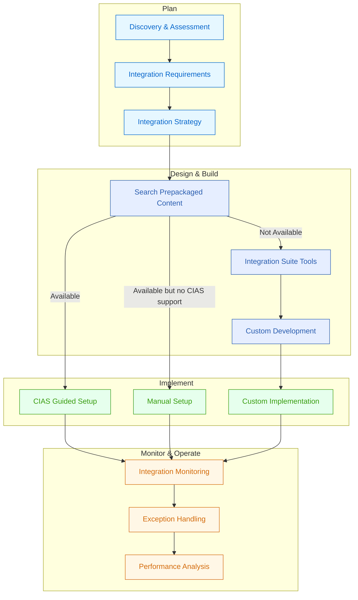

```mermaid
flowchart TB
    subgraph "Plan"
        A1[Discovery & Assessment]
        A2[Integration Requirements]
        A3[Integration Strategy]
    end

    subgraph "Design & Build"
        B1[Search Prepackaged Content]
        B2[Integration Suite Tools]
        B3[Custom Development]
    end

    subgraph "Implement"
        C1[CIAS Guided Setup]
        C2[Manual Setup]
        C3[Custom Implementation]
    end

    subgraph "Monitor & Operate"
        D1[Integration Monitoring]
        D2[Exception Handling]
        D3[Performance Analysis]
    end

    A1 --> A2 --> A3
    A3 --> B1
    B1 -->|Available| C1
    B1 -->|Not Available| B2
    B2 --> B3 --> C3
    B1 -->|Available but no CIAS support| C2
    C1 & C2 & C3 --> D1 --> D2 --> D3

    classDef phase1 fill:#e6f7ff,stroke:#0066cc,color:#0066cc
    classDef phase2 fill:#e6eeff,stroke:#2a5db0,color:#2a5db0
    classDef phase3 fill:#e6ffed,stroke:#389e0d,color:#389e0d
    classDef phase4 fill:#fff7e6,stroke:#d46b08,color:#d46b08

    class A1,A2,A3 phase1
    class B1,B2,B3 phase2
    class C1,C2,C3 phase3
    class D1,D2,D3 phase4
```
