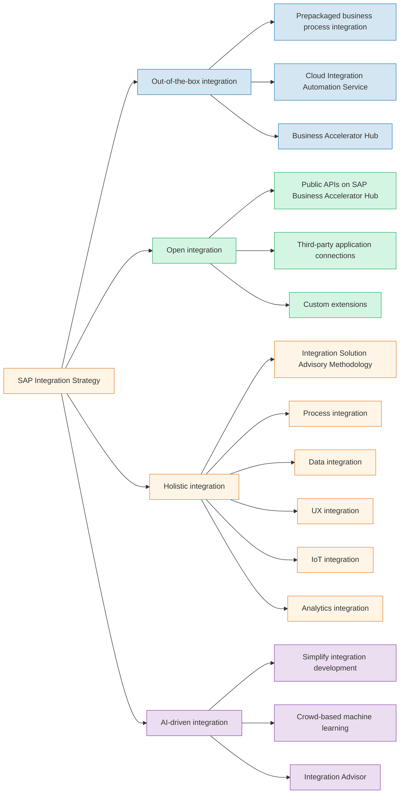

```mermaid
flowchart LR
    A[SAP Integration Strategy] --> B[Out-of-the-box integration]
    A --> C[Open integration]
    A --> D[Holistic integration]
    A --> E[AI-driven integration]
    
    B --> B1[Prepackaged business process integration]
    B --> B2[Cloud Integration Automation Service]
    B --> B3[Business Accelerator Hub]
    
    C --> C1[Public APIs on SAP Business Accelerator Hub]
    C --> C2[Third-party application connections]
    C --> C3[Custom extensions]
    
    D --> D1[Integration Solution Advisory Methodology]
    D --> D2[Process integration]
    D --> D3[Data integration]
    D --> D4[UX integration]
    D --> D5[IoT integration]
    D --> D6[Analytics integration]
    
    E --> E1[Simplify integration development]
    E --> E2[Crowd-based machine learning]
    E --> E3[Integration Advisor]
    
    classDef blue fill:#d4e6f1,stroke:#2980b9,stroke-width:1px;
    classDef orange fill:#fef5e7,stroke:#e67e22,stroke-width:1px;
    classDef green fill:#d5f5e3,stroke:#27ae60,stroke-width:1px;
    classDef purple fill:#ebdef0,stroke:#8e44ad,stroke-width:1px;
    
    class A orange;
    class B,B1,B2,B3 blue;
    class C,C1,C2,C3 green;
    class D,D1,D2,D3,D4,D5,D6 orange;
    class E,E1,E2,E3 purple;
```
