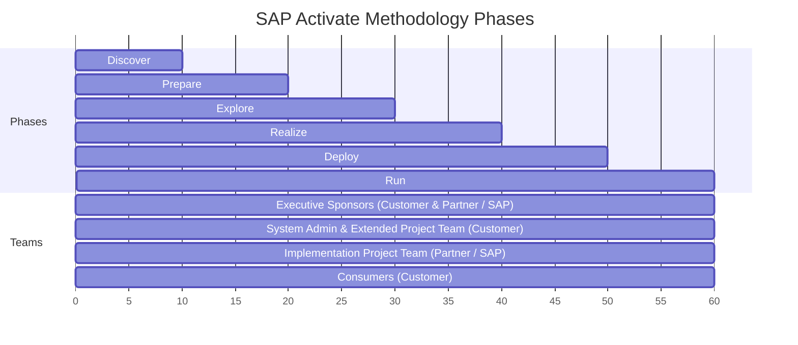

```mermaid
gantt
    title SAP Activate Methodology Phases
    dateFormat X
    axisFormat %s
    
    section Phases
    Discover       : 0, 10
    Prepare        : 10, 20
    Explore        : 20, 30
    Realize        : 30, 40
    Deploy         : 40, 50
    Run            : 50, 60
    
    section Teams
    Executive Sponsors (Customer & Partner / SAP) : es, 0, 60
    System Admin & Extended Project Team (Customer) : sysadmin, 10, 60
    Implementation Project Team (Partner / SAP) : impl, 10, 60
    Consumers (Customer) : consumers, 40, 60
```
