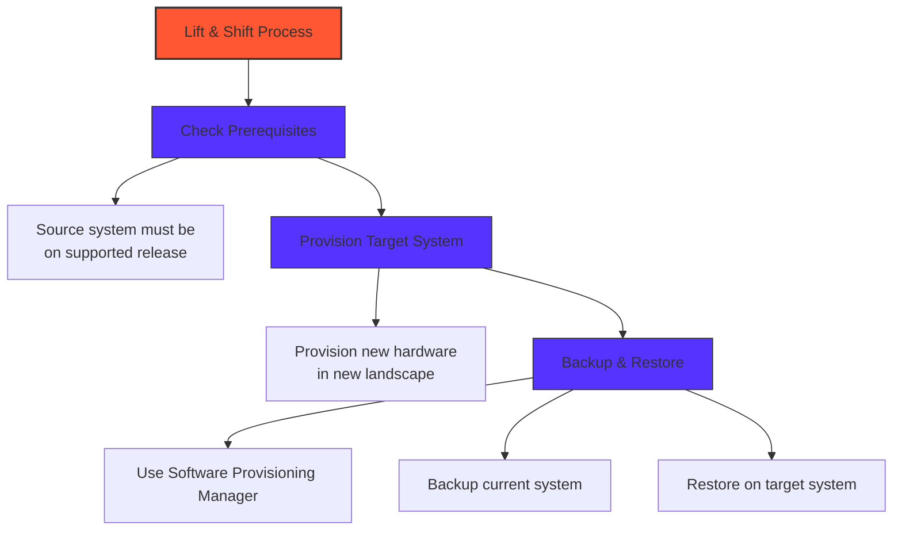

```mermaid
graph TD
    A[Lift & Shift Process] --> B[Check Prerequisites]
    B --> B1[Source system must be\non supported release]
    B --> C[Provision Target System]
    C --> C1[Provision new hardware\nin new landscape]
    C --> D[Backup & Restore]
    D --> D1[Use Software Provisioning Manager]
    D --> D2[Backup current system]
    D --> D3[Restore on target system]
    
    style A fill:#FF5733,stroke:#333,stroke-width:2px
    style B fill:#5733FF,stroke:#333
    style C fill:#5733FF,stroke:#333
    style D fill:#5733FF,stroke:#333
```
