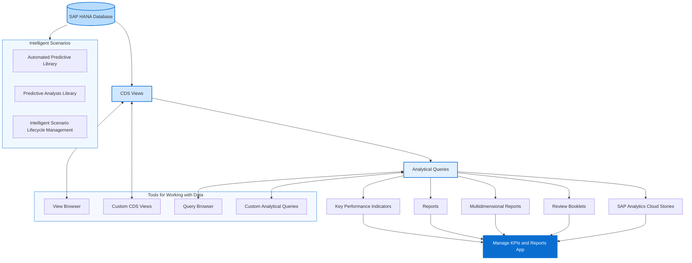

```mermaid
flowchart TD
    DB[(SAP HANA Database)] --> CDS[CDS Views]
    CDS --> AQ[Analytical Queries]
    
    subgraph Tools[Tools for Working with Data]
        VIEW[View Browser]
        CVIEW[Custom CDS Views]
        QUERY[Query Browser]
        CQUERY[Custom Analytical Queries]
    end
    
    CDS <--> VIEW
    CDS <--> CVIEW
    AQ <--> QUERY
    AQ <--> CQUERY
    
    AQ --> KPI[Key Performance Indicators]
    AQ --> RPT[Reports]
    AQ --> MDR[Multidimensional Reports]
    AQ --> BOOK[Review Booklets]
    AQ --> SAC[SAP Analytics Cloud Stories]
    
    KPI & RPT & MDR & BOOK & SAC --> MANAGE[Manage KPIs and Reports App]
    
    subgraph ML[Intelligent Scenarios]
        APL[Automated Predictive Library]
        PAL[Predictive Analysis Library]
        ISLM[Intelligent Scenario Lifecycle Management]
    end
    
    DB --> ML
    
    style DB fill:#b8dcff,stroke:#0a6ed1,stroke-width:2px
    style CDS fill:#d1e7ff,stroke:#0a6ed1,stroke-width:2px
    style AQ fill:#e2f0ff,stroke:#0a6ed1,stroke-width:2px
    style MANAGE fill:#0a6ed1,stroke:#0a6ed1,color:#ffffff,stroke-width:2px
    style Tools fill:#f5f9ff,stroke:#0a6ed1,stroke-width:1px
    style ML fill:#f0f8ff,stroke:#0a6ed1,stroke-width:1px
```
