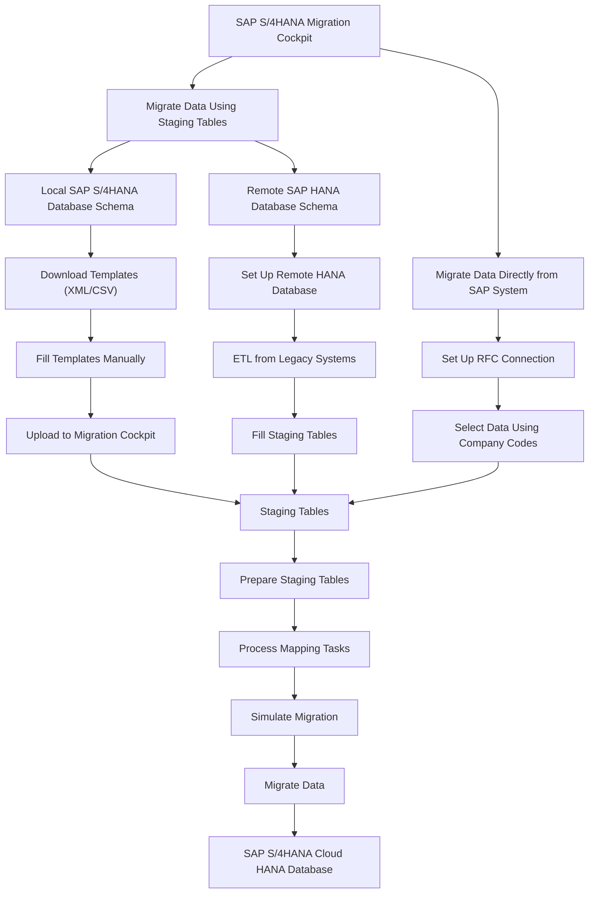

```mermaid
flowchart TB
    A["SAP S/4HANA Migration Cockpit"] --> B["Migrate Data Using Staging Tables"]
    A --> C["Migrate Data Directly from SAP System"]
    
    B --> D["Local SAP S/4HANA Database Schema"]
    B --> E["Remote SAP HANA Database Schema"]
    
    D --> F["Download Templates (XML/CSV)"]
    F --> G["Fill Templates Manually"]
    G --> H["Upload to Migration Cockpit"]
    
    E --> I["Set Up Remote HANA Database"]
    I --> J["ETL from Legacy Systems"]
    J --> K["Fill Staging Tables"]
    
    C --> L["Set Up RFC Connection"]
    L --> M["Select Data Using Company Codes"]
    
    H --> N["Staging Tables"]
    K --> N
    M --> N
    
    N --> O["Prepare Staging Tables"]
    O --> P["Process Mapping Tasks"]
    P --> Q["Simulate Migration"]
    Q --> R["Migrate Data"]
    R --> S["SAP S/4HANA Cloud HANA Database"]
```
