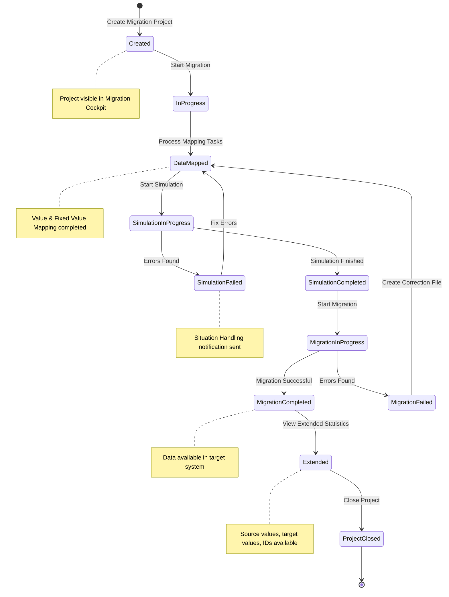

```mermaid
stateDiagram-v2
    [*] --> Created: Create Migration Project
    Created --> InProgress: Start Migration
    InProgress --> DataMapped: Process Mapping Tasks
    DataMapped --> SimulationInProgress: Start Simulation
    SimulationInProgress --> SimulationCompleted: Simulation Finished
    SimulationInProgress --> SimulationFailed: Errors Found
    SimulationFailed --> DataMapped: Fix Errors
    SimulationCompleted --> MigrationInProgress: Start Migration
    MigrationInProgress --> MigrationCompleted: Migration Successful
    MigrationInProgress --> MigrationFailed: Errors Found
    MigrationFailed --> DataMapped: Create Correction File
    MigrationCompleted --> Extended: View Extended Statistics
    Extended --> ProjectClosed: Close Project
    ProjectClosed --> [*]
    
    note right of Created: Project visible in Migration Cockpit
    note right of DataMapped: Value & Fixed Value Mapping completed
    note right of SimulationFailed: Situation Handling notification sent
    note right of MigrationCompleted: Data available in target system
    note right of Extended: Source values, target values, IDs available
```
