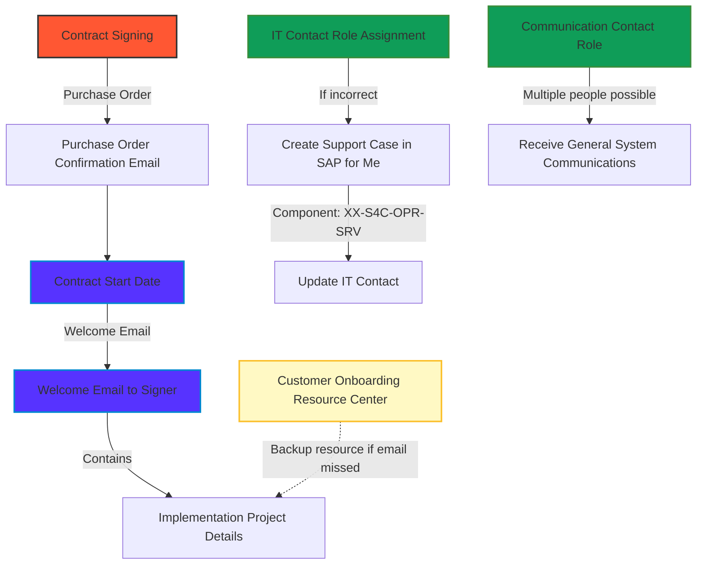

```mermaid
flowchart TD
    A[Contract Signing] -->|Purchase Order| B[Purchase Order Confirmation Email]
    B --> C[Contract Start Date]
    C -->|Welcome Email| D[Welcome Email to Signer]
    D -->|Contains| E[Implementation Project Details]
    
    F[Customer Onboarding Resource Center] -.->|Backup resource if email missed| E
    
    G[IT Contact Role Assignment] -->|If incorrect| H[Create Support Case in SAP for Me]
    H -->|Component: XX-S4C-OPR-SRV| I[Update IT Contact]
    
    J[Communication Contact Role] -->|Multiple people possible| K[Receive General System Communications]
    
    style A fill:#FF5733,stroke:#333,stroke-width:2px
    style C fill:#5733FF,stroke:#0288d1,stroke-width:2px
    style D fill:#5733FF,stroke:#0288d1,stroke-width:2px
    style F fill:#fff9c4,stroke:#fbc02d,stroke-width:2px
    style G fill:#0F9D58,stroke:#388e3c,stroke-width:2px
    style J fill:#0F9D58,stroke:#388e3c,stroke-width:2px
```
