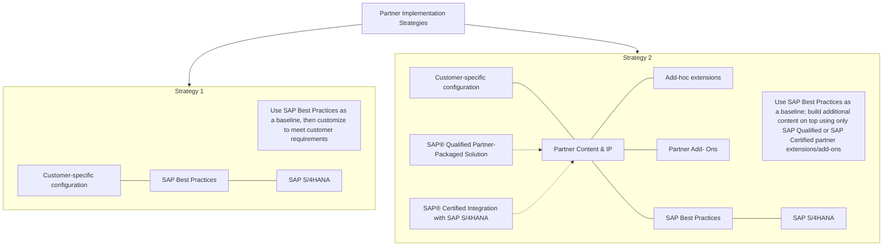

```mermaid
%% Diagram 1: Partner Implementation Strategies
flowchart TD
    title["Partner Implementation Strategies"]
    
    subgraph Strategy1["Strategy 1"]
        S1_Title["Use SAP Best Practices as a baseline, then customize to meet customer requirements"]
        
        S1_Stack1["Customer-specific configuration"]
        S1_Stack2["SAP Best Practices"]
        S1_Stack3["SAP S/4HANA"]
        
        S1_Stack1 --- S1_Stack2 --- S1_Stack3
    end
    
    subgraph Strategy2["Strategy 2"]
        S2_Title["Use SAP Best Practices as a baseline; build additional content on top using only SAP Qualified or SAP Certified partner extensions/add-ons"]
        
        S2_Stack1["Customer-specific configuration"]
        S2_Stack2["Partner Content & IP"]
        S2_Extensions["Add-hoc extensions"]
        S2_Addons["Partner Add- Ons"]
        S2_Stack3["SAP Best Practices"]
        S2_Stack4["SAP S/4HANA"]
        
        S2_Stack1 --- S2_Stack2
        S2_Stack2 --- S2_Extensions
        S2_Stack2 --- S2_Addons
        S2_Stack2 --- S2_Stack3
        S2_Stack3 --- S2_Stack4
        
        S2_Left["SAP® Qualified Partner-Packaged Solution"]
        S2_Right["SAP® Certified Integration with SAP S/4HANA"]
        
        S2_Left -.-> S2_Stack2
        S2_Right -.-> S2_Stack2
    end
    
    title --> Strategy1
    title --> Strategy2
```
