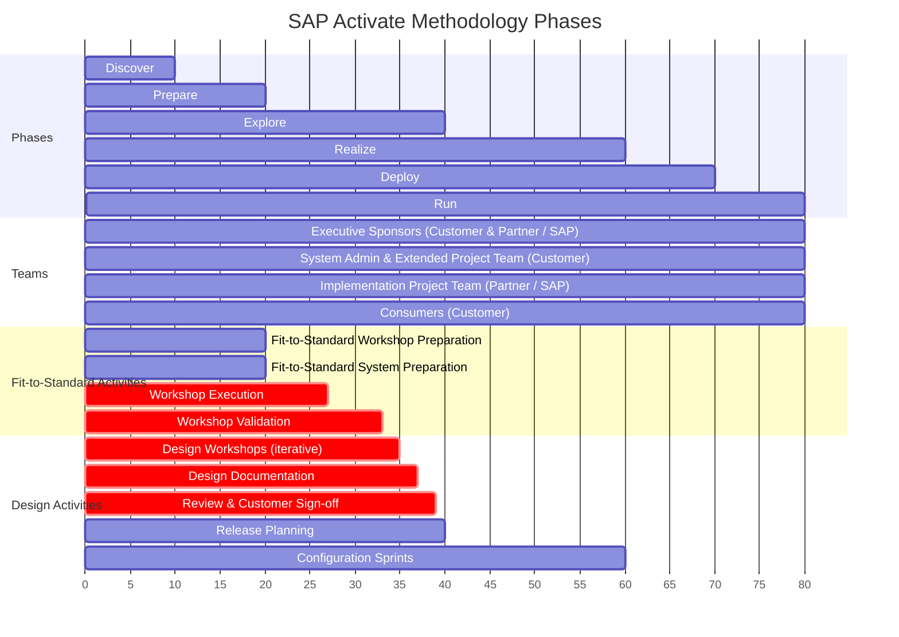

```mermaid
gantt
    title SAP Activate Methodology Phases
    dateFormat X
    axisFormat %s
    
    section Phases
    Discover       : 0, 10
    Prepare        : 10, 20
    Explore        : 20, 40
    Realize        : 40, 60
    Deploy         : 60, 70
    Run            : 70, 80
    
    section Teams
    Executive Sponsors (Customer & Partner / SAP) : es, 0, 80
    System Admin & Extended Project Team (Customer) : sysadmin, 10, 80
    Implementation Project Team (Partner / SAP) : impl, 10, 80
    Consumers (Customer) : consumers, 60, 80
    
    section Fit-to-Standard Activities
    Fit-to-Standard Workshop Preparation : ftsprep, 10, 20
    Fit-to-Standard System Preparation   : ftssys, 10, 20
    Workshop Execution                   : crit, wexec, 20, 27
    Workshop Validation                  : crit, wvalid, 27, 33
    
    section Design Activities
    Design Workshops (iterative)         : crit, dwork, 33, 35
    Design Documentation                 : crit, ddoc, 35, 37
    Review & Customer Sign-off           : crit, rsign, 37, 39
    Release Planning                     : rplan, 39, 40
    Configuration Sprints                : csprint, 40, 60
```
