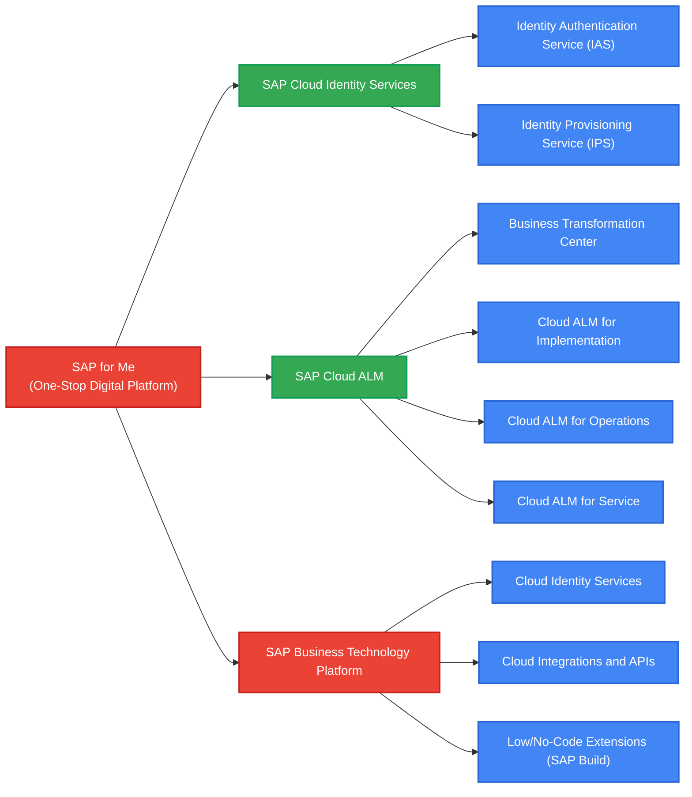

```mermaid
flowchart LR
    SFM["SAP for Me\n(One-Stop Digital Platform)"] --> SCIS["SAP Cloud Identity Services"]
    SFM --> CALM["SAP Cloud ALM"]
    SFM --> BTP["SAP Business Technology Platform"]
    
    SCIS --> IAS["Identity Authentication Service (IAS)"]
    SCIS --> IPS["Identity Provisioning Service (IPS)"]
    
    CALM --> BTC["Business Transformation Center"]
    CALM --> IMP["Cloud ALM for Implementation"]
    CALM --> OPS["Cloud ALM for Operations"]
    CALM --> SER["Cloud ALM for Service"]
    
    BTP --> CAI["Cloud Identity Services"]
    BTP --> CIA["Cloud Integrations and APIs"]
    BTP --> CEX["Low/No-Code Extensions (SAP Build)"]
    
    classDef platform fill:#EA4335,color:white,stroke:#C5221F,stroke-width:2px
    classDef service fill:#34A853,color:white,stroke:#0F9D58,stroke-width:2px
    classDef component fill:#4285F4,color:white,stroke:#2A67D4,stroke-width:2px
    
    class SFM,BTP platform
    class SCIS,CALM service
    class IAS,IPS,BTC,IMP,OPS,SER,CAI,CIA,CEX component
```
