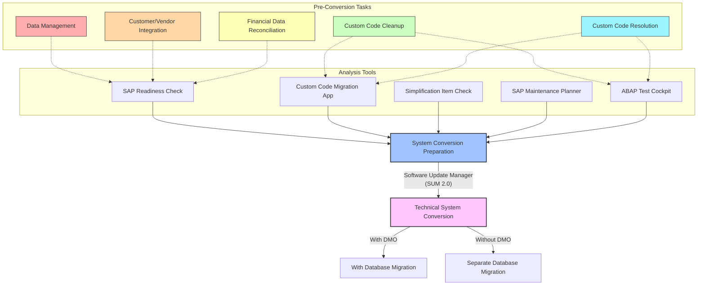

```mermaid
graph TD
    subgraph "Pre-Conversion Tasks"
        A[Data Management]
        B[Customer/Vendor Integration]
        C[Financial Data Reconciliation]
        D[Custom Code Cleanup]
        E[Custom Code Resolution]
    end
    
    subgraph "Analysis Tools"
        F[SAP Readiness Check]
        G[Custom Code Migration App]
        H[Simplification Item Check]
        I[SAP Maintenance Planner]
        J[ABAP Test Cockpit]
    end
    
    A -.-> F
    B -.-> F
    C -.-> F
    D -.-> G
    D -.-> J
    E -.-> G
    E -.-> J
    
    F --> K[System Conversion Preparation]
    G --> K
    H --> K
    I --> K
    J --> K
    
    K -->|"Software Update Manager\n(SUM 2.0)"| L[Technical System Conversion]
    L -->|"With DMO"| M[With Database Migration]
    L -->|"Without DMO"| N[Separate Database Migration]
    
    style A fill:#ffadad,stroke:#333,stroke-width:1px
    style B fill:#ffd6a5,stroke:#333,stroke-width:1px
    style C fill:#fdffb6,stroke:#333,stroke-width:1px
    style D fill:#caffbf,stroke:#333,stroke-width:1px
    style E fill:#9bf6ff,stroke:#333,stroke-width:1px
    style K fill:#a0c4ff,stroke:#333,stroke-width:2px
    style L fill:#ffc6ff,stroke:#333,stroke-width:2px
```
