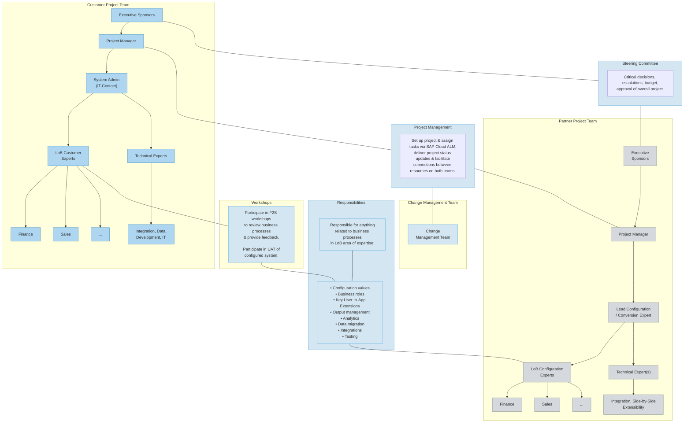

```mermaid
flowchart TD
    subgraph Customer["Customer Project Team"]
        direction TB
        custExec["Executive Sponsors"]
        custPM["Project Manager"]
        custSysAdmin["System Admin<br>(IT Contact)"]
        custLoBExp["LoB Customer<br>Experts"]
        custFinance["Finance"]
        custSales["Sales"]
        custDots["..."]
        custTech["Technical Experts"]
        custTechDet["Integration, Data,<br>Development, IT"]
        
        custExec --> custPM
        custPM --> custSysAdmin
        custSysAdmin --> custLoBExp
        custLoBExp --> custFinance
        custLoBExp --> custSales
        custLoBExp --> custDots
        custSysAdmin --> custTech
        custTech --> custTechDet
    end
    
    subgraph Steering["Steering Committee"]
        direction TB
        steerDesc["Critical decisions, escalations, budget,<br>approval of overall project."]
    end
    
    subgraph ProjectMgmt["Project Management"]
        direction TB
        pmDesc["Set up project & assign tasks via SAP Cloud ALM,<br>deliver project status updates & facilitate<br>connections between resources on both teams."]
    end
    
    subgraph ChangeMgmt["Change Management Team"]
        direction TB
        changeTeam["Change<br>Management Team"]
    end
    
    subgraph Responsibilities["Responsibilities"]
        direction TB
        respTitle["Responsible for anything<br>related to business processes<br>in LoB area of expertise:"]
        respList["• Configuration values<br>• Business roles<br>• Key User In-App Extensions<br>• Output management<br>• Analytics<br>• Data migration<br>• Integrations<br>• Testing"]
    end
    
    subgraph Workshop["Workshops"]
        direction TB
        workshops["Participate in F2S workshops<br>to review business processes<br>& provide feedback.<br><br>Participate in UAT of<br>configured system."]
    end
    
    subgraph Partner["Partner Project Team"]
        direction TB
        partExec["Executive<br>Sponsors"]
        partPM["Project Manager"]
        partConfig["Lead Configuration<br>/ Conversion Expert"]
        partLoBConf["LoB Configuration<br>Experts"]
        partFinance["Finance"]
        partSales["Sales"]
        partDots["..."]
        partTech["Technical Expert(s)"]
        partTechDet["Integration, Side-by-Side<br>Extensibility"]
        
        partExec --> partPM
        partPM --> partConfig
        partConfig --> partLoBConf
        partLoBConf --> partFinance
        partLoBConf --> partSales
        partLoBConf --> partDots
        partConfig --> partTech
        partTech --> partTechDet
    end
    
    %% Connect the steering committee to both executive sponsors
    custExec --- Steering --- partExec
    
    %% Connect both project managers to project management
    custPM --- ProjectMgmt --- partPM
    
    %% Connect change management team
    ProjectMgmt --- changeTeam
    
    %% Connect workshop to LoB experts
    custLoBExp --- workshops
    
    %% Connect responsibilities to LoB configuration experts
    workshops --- respList
    respTitle --- respList
    respList --- partLoBConf
    
    %% Styles
    classDef customerBox fill:#AED6F1,stroke:#2E86C1,stroke-width:1px
    classDef partnerBox fill:#D5D8DC,stroke:#7F8C8D,stroke-width:1px
    classDef sharedBox fill:#D4E6F1,stroke:#5DADE2,stroke-width:1px
    
    class custExec,custPM,custSysAdmin,custLoBExp,custFinance,custSales,custDots,custTech,custTechDet customerBox
    class partExec,partPM,partConfig,partLoBConf,partFinance,partSales,partDots,partTech,partTechDet partnerBox
    class Steering,ProjectMgmt,changeTeam,Responsibilities,respTitle,respList,workshops sharedBox
```
