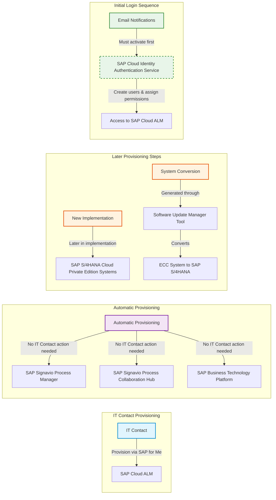

```mermaid
flowchart LR
    subgraph "IT Contact Provisioning"
        A[IT Contact] -->|Provision via SAP for Me| B[SAP Cloud ALM]
    end
    
    subgraph "Automatic Provisioning"
        C[Automatic Provisioning] -->|No IT Contact action needed| D[SAP Signavio Process Manager]
        C -->|No IT Contact action needed| E[SAP Signavio Process Collaboration Hub]
        C -->|No IT Contact action needed| F[SAP Business Technology Platform]
    end
    
    subgraph "Later Provisioning Steps"
        G[New Implementation] -->|Later in implementation| H[SAP S/4HANA Cloud Private Edition Systems]
        I[System Conversion] -->|Generated through| J[Software Update Manager Tool]
        J -->|Converts| K[ECC System to SAP S/4HANA]
    end
    
    subgraph "Initial Login Sequence"
        L[Email Notifications] -->|Must activate first| M[SAP Cloud Identity Authentication Service]
        M -->|Create users & assign permissions| N[Access to SAP Cloud ALM]
    end
    
    style A fill:#e1f5fe,stroke:#0288d1,stroke-width:2px
    style C fill:#f3e5f5,stroke:#7b1fa2,stroke-width:2px
    style G fill:#fff3e0,stroke:#e65100,stroke-width:2px
    style I fill:#fff3e0,stroke:#e65100,stroke-width:2px
    style L fill:#e8f5e9,stroke:#388e3c,stroke-width:2px
    style M fill:#e8f5e9,stroke:#388e3c,stroke-width:2px,stroke-dasharray: 5 5
```
