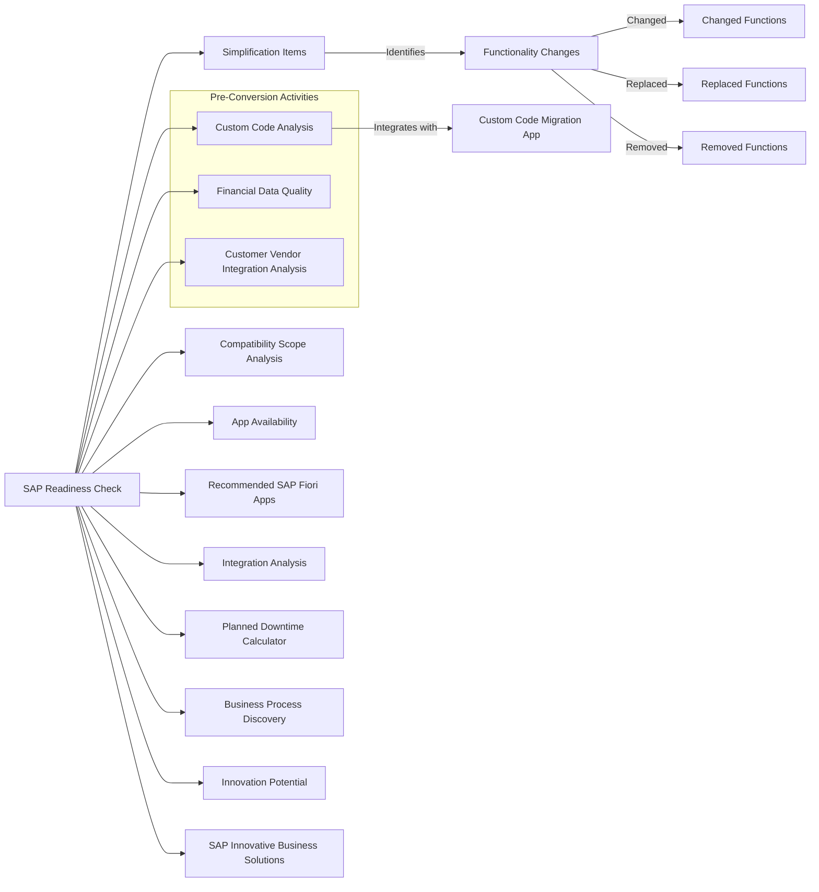

```mermaid
flowchart LR
    RC[SAP Readiness Check] --> SI[Simplification Items]
    RC --> CSA[Compatibility Scope Analysis]
    RC --> CCA[Custom Code Analysis]
    RC --> FDQ[Financial Data Quality]
    RC --> AA[App Availability]
    RC --> RFAR[Recommended SAP Fiori Apps]
    RC --> IA[Integration Analysis]
    RC --> CVIA[Customer Vendor Integration Analysis]
    RC --> PDC[Planned Downtime Calculator]
    RC --> BPD[Business Process Discovery]
    RC --> IP[Innovation Potential]
    RC --> IBSO[SAP Innovative Business Solutions]
    
    SI[Simplification Items] -->|"Identifies"| CHANGES[Functionality Changes]
    CHANGES -->|"Changed"| C1[Changed Functions]
    CHANGES -->|"Replaced"| C2[Replaced Functions]
    CHANGES -->|"Removed"| C3[Removed Functions]
    
    CCA -->|"Integrates with"| CCMA[Custom Code Migration App]
    
    subgraph "Pre-Conversion Activities"
        FDQ
        CCA
        CVIA
    end
```
