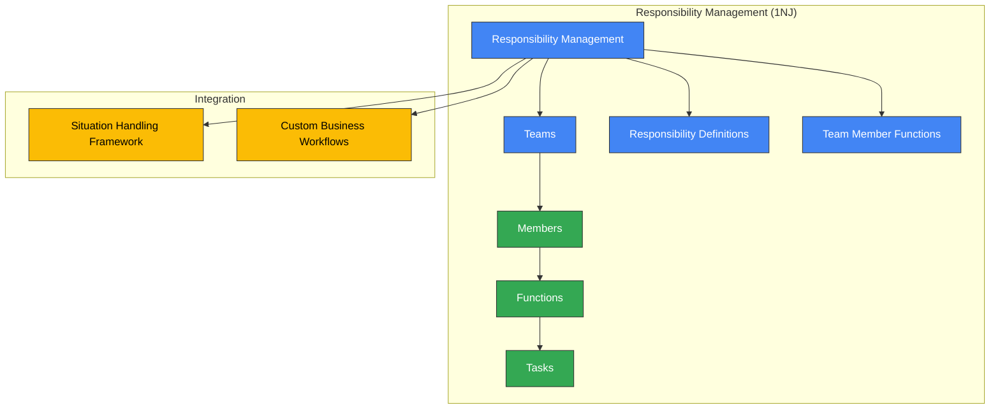

```mermaid
flowchart TB
    subgraph "Responsibility Management (1NJ)"
        RM[Responsibility Management] --> Teams
        RM --> RD[Responsibility Definitions]
        RM --> TMF[Team Member Functions]
        Teams --> Members
        Members --> Functions
        Functions --> Tasks
    end
    
    subgraph "Integration"
        RM --> SHF[Situation Handling Framework]
        RM --> CBW[Custom Business Workflows]
    end
    
    classDef primary fill:#4285F4,stroke:#333,stroke-width:1px,color:white
    classDef secondary fill:#34A853,stroke:#333,stroke-width:1px,color:white
    classDef integration fill:#FBBC05,stroke:#333,stroke-width:1px,color:black
    
    class RM,Teams,RD,TMF primary
    class Members,Functions,Tasks secondary
    class SHF,CBW integration
```
