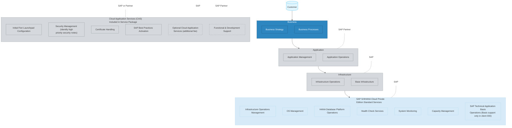

```mermaid
flowchart TB
    subgraph S4["SAP S/4HANA Cloud Private<br>Edition Standard Services"]
        direction TB
        infra["Infrastructure Operations Management"]
        os["OS Management"]
        hanaDB["HANA Database Platform Operations"]
        health["Health Check Services"]
        monitor["System Monitoring"]
        capacity["Capacity Management"]
        basis["SAP Technical Application Basis<br>Operations (Basis support only in client 000)"]
    end
    
    subgraph Business["Business"]
        direction TB
        strategy["Business Strategy"]
        processes["Business Processes"]
    end
    
    subgraph Application["Application"]
        direction TB
        appMgmt["Application Management"]
        appOps["Application Operations"]
    end
    
    subgraph Infrastructure["Infrastructure"]
        direction TB
        infraOps["Infrastructure Operations"]
        baseInfra["Base Infrastructure"]
    end
    
    subgraph CAS["Cloud Application Services (CAS)<br>Included in Service Package"]
        direction TB
        fiori["Initial Fiori Launchpad Configuration"]
        security["Security Management (Identify high<br>priority security notes)"]
        cert["Certificate Handling"]
        bestPractices["SAP Best Practices Activation"]
        
        optional["Optional Cloud Application<br>Services (additional fee)"]
        funcDev["Functional & Development Support"]
    end
    
    %% Link the components
    Business --> Application
    Application --> Infrastructure
    Infrastructure --> S4
    
    %% Create a customer icon
    customer[("Customer")]
    customer --> Business
    
    %% Add SAP/Partner labels
    sapLabel1["SAP"]
    sapLabel2["SAP"]
    sapLabel3["SAP"]
    sapPartnerLabel1["SAP Partner"]
    sapPartnerLabel2["SAP Partner"]
    sapOrPartner["SAP or Partner"]
    
    %% Link labels to components
    sapLabel1 -.- S4
    sapPartnerLabel1 -.- Application
    sapLabel2 -.- Infrastructure
    sapOrPartner -.- CAS
    
    %% Styles
    classDef s4Box fill:#D6EAF8,stroke:#AED6F1,stroke-width:1px
    classDef businessBox fill:#2E86C1,stroke:#1A5276,stroke-width:1px,color:white
    classDef appBox fill:#D5D8DC,stroke:#7F8C8D,stroke-width:1px
    classDef infraBox fill:#D5D8DC,stroke:#7F8C8D,stroke-width:1px
    classDef casBox fill:#D5D8DC,stroke:#7F8C8D,stroke-width:1px
    classDef optional fill:#D5D8DC,stroke:#7F8C8D,stroke-dasharray: 5 5
    classDef sapLabel fill:white,stroke:none
    classDef customerIcon fill:#E1F5FE,stroke:#81D4FA,stroke-width:2px,border-radius:50%
    
    class S4,infra,os,hanaDB,health,monitor,capacity,basis s4Box
    class Business,strategy,processes businessBox
    class Application,appMgmt,appOps appBox
    class Infrastructure,infraOps,baseInfra infraBox
    class CAS,fiori,security,cert,bestPractices casBox
    class optional,funcDev optional
    class sapLabel1,sapLabel2,sapLabel3,sapPartnerLabel1,sapPartnerLabel2,sapOrPartner sapLabel
    class customer customerIcon
```
