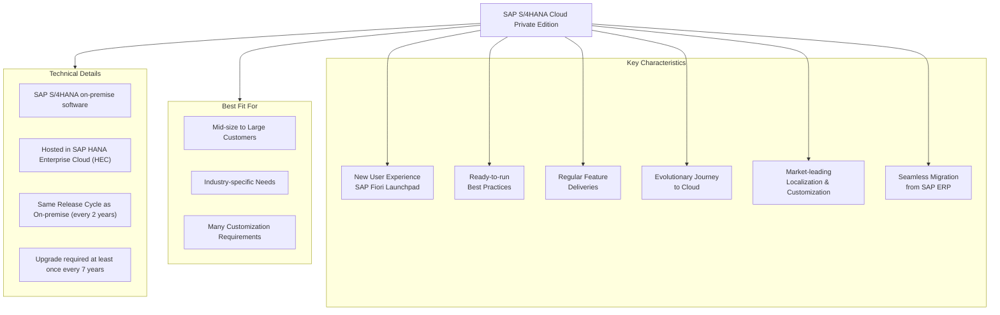

```mermaid
flowchart TD
    s4hana["SAP S/4HANA Cloud Private Edition"]
    s4hana --> ux["New User Experience<br/>SAP Fiori Launchpad"]
    s4hana --> bp["Ready-to-run<br/>Best Practices"]
    s4hana --> fd["Regular Feature<br/>Deliveries"]
    s4hana --> ej["Evolutionary Journey<br/>to Cloud"]
    s4hana --> lc["Market-leading<br/>Localization & Customization"]
    s4hana --> sm["Seamless Migration<br/>from SAP ERP"]
    
    subgraph key["Key Characteristics"]
        ux
        bp
        fd
        ej
        lc
        sm
    end
    
    subgraph fit["Best Fit For"]
        mid["Mid-size to Large Customers"]
        ind["Industry-specific Needs"]
        cust["Many Customization Requirements"]
    end
    
    s4hana --> fit
    
    subgraph tech["Technical Details"]
        onprem["SAP S/4HANA on-premise software"]
        hec["Hosted in SAP HANA Enterprise Cloud (HEC)"]
        rel["Same Release Cycle as On-premise (every 2 years)"]
        upg["Upgrade required at least once every 7 years"]
    end
    
    s4hana --> tech
```
