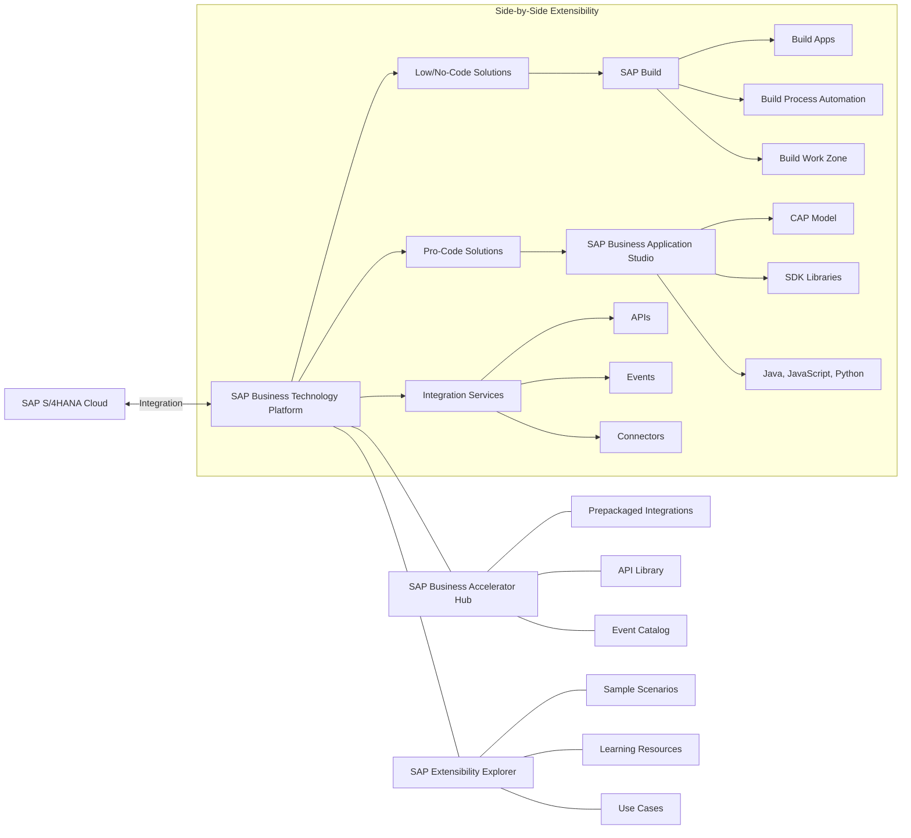

```mermaid
flowchart LR
    A[SAP S/4HANA Cloud] <-->|Integration| B[SAP Business Technology Platform]
    
    subgraph "Side-by-Side Extensibility"
    B --> C[Low/No-Code Solutions]
    B --> D[Pro-Code Solutions]
    
    C --> C1[SAP Build]
    C1 --> C11[Build Apps]
    C1 --> C12[Build Process Automation]
    C1 --> C13[Build Work Zone]
    
    D --> D1[SAP Business Application Studio]
    D1 --> D11[CAP Model]
    D1 --> D12[SDK Libraries]
    D1 --> D13[Java, JavaScript, Python]
    
    B --> E[Integration Services]
    E --> E1[APIs]
    E --> E2[Events]
    E --> E3[Connectors]
    end
    
    B --- F[SAP Business Accelerator Hub]
    F --- F1[Prepackaged Integrations]
    F --- F2[API Library]
    F --- F3[Event Catalog]
    
    B --- G[SAP Extensibility Explorer]
    G --- G1[Sample Scenarios]
    G --- G2[Learning Resources]
    G --- G3[Use Cases]
```
