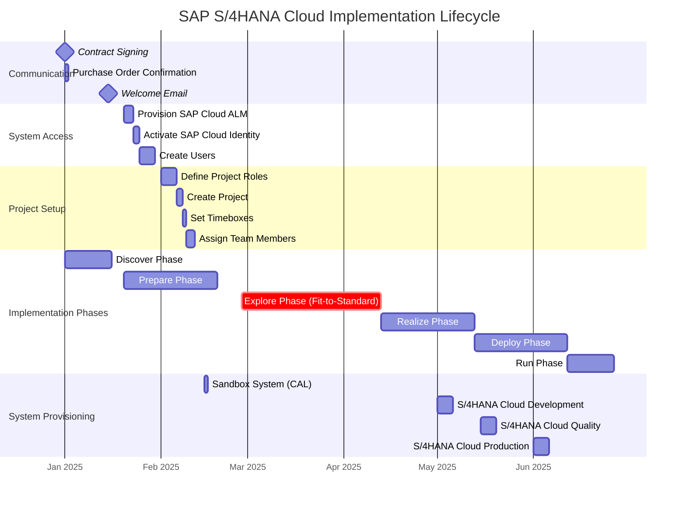

```mermaid
gantt
    title SAP S/4HANA Cloud Implementation Lifecycle
    dateFormat  YYYY-MM-DD
    axisFormat  %b %Y
    
    section Communication
    Contract Signing                 :milestone, m1, 2025-01-01, 0d
    Purchase Order Confirmation      :after m1, 1d
    Welcome Email                    :milestone, m2, 2025-01-15, 0d
    
    section System Access
    Provision SAP Cloud ALM          :2025-01-20, 3d
    Activate SAP Cloud Identity      :2025-01-23, 2d
    Create Users                     :2025-01-25, 5d
    
    section Project Setup
    Define Project Roles             :2025-02-01, 5d
    Create Project                   :2025-02-06, 2d
    Set Timeboxes                    :2025-02-08, 1d
    Assign Team Members              :2025-02-09, 3d
    
    section Implementation Phases
    Discover Phase                   :2025-01-01, 15d
    Prepare Phase                    :2025-01-20, 30d
    Explore Phase (Fit-to-Standard)  :crit, 2025-02-27, 45d
    Realize Phase                    :2025-04-13, 30d
    Deploy Phase                     :2025-05-13, 30d
    Run Phase                        :2025-06-12, 15d
    
    section System Provisioning
    Sandbox System (CAL)             :2025-02-15, 1d
    S/4HANA Cloud Development        :2025-05-01, 5d
    S/4HANA Cloud Quality            :2025-05-15, 5d
    S/4HANA Cloud Production         :2025-06-01, 5d
```
