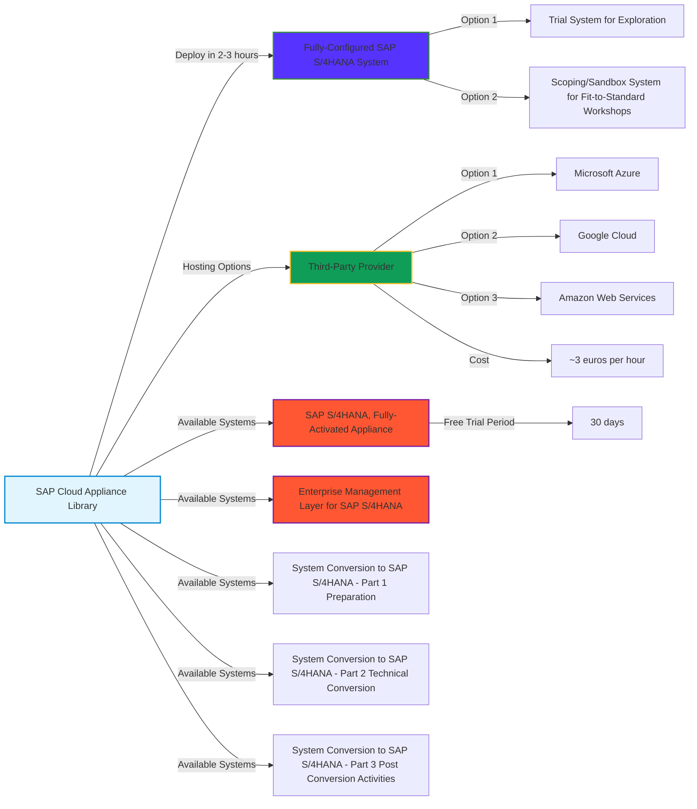

```mermaid
flowchart LR
    A[SAP Cloud Appliance Library] -->|Deploy in 2-3 hours| B[Fully-Configured SAP S/4HANA System]
    
    B -->|Option 1| C[Trial System for Exploration]
    B -->|Option 2| D[Scoping/Sandbox System for Fit-to-Standard Workshops]
    
    A -->|Hosting Options| E[Third-Party Provider]
    E -->|Option 1| F[Microsoft Azure]
    E -->|Option 2| G[Google Cloud]
    E -->|Option 3| H[Amazon Web Services]
    E -->|Cost| I[~3 euros per hour]
    
    A -->|Available Systems| J[SAP S/4HANA, Fully-Activated Appliance]
    A -->|Available Systems| K[Enterprise Management Layer for SAP S/4HANA]
    A -->|Available Systems| L[System Conversion to SAP S/4HANA - Part 1 Preparation]
    A -->|Available Systems| M[System Conversion to SAP S/4HANA - Part 2 Technical Conversion]
    A -->|Available Systems| N[System Conversion to SAP S/4HANA - Part 3 Post Conversion Activities]
    
    J -->|Free Trial Period| O[30 days]
    
    style A fill:#e1f5fe,stroke:#0288d1,stroke-width:2px
    style B fill:#5733FF,stroke:#388e3c,stroke-width:2px
    style E fill:#0F9D58 ,stroke:#fbc02d,stroke-width:2px
    style J fill:#FF5733,stroke:#7b1fa2,stroke-width:2px
    style K fill:#FF5733,stroke:#7b1fa2,stroke-width:2px
```
