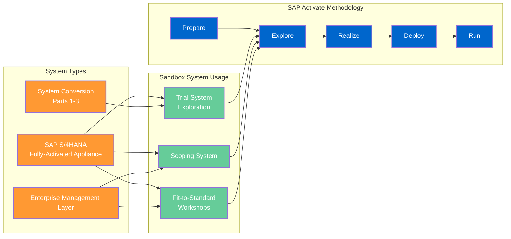

```mermaid
flowchart LR
    subgraph "SAP Activate Methodology"
        A[Prepare] --> B[Explore] --> C[Realize] --> D[Deploy] --> E[Run]
    end
    
    subgraph "Sandbox System Usage"
        F[Trial System\nExploration] --> B
        G[Scoping System] --> B
        H[Fit-to-Standard\nWorkshops] --> B
    end
    
    subgraph "System Types"
        I[SAP S/4HANA\nFully-Activated Appliance] --> F & G & H
        J[Enterprise Management Layer] --> G & H
        K[System Conversion\nParts 1-3] --> F
    end
    
    classDef phase fill:#0066cc,color:white,stroke-width:2px
    classDef usage fill:#66cc99,color:white,stroke-width:2px
    classDef system fill:#ff9933,color:white,stroke-width:2px
    
    class A,B,C,D,E phase
    class F,G,H usage
    class I,J,K system
```
