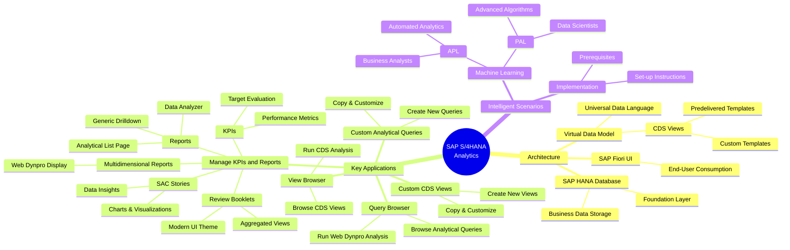

```mermaid
mindmap
  root((SAP S/4HANA<br>Analytics))
    Architecture
      SAP HANA Database
        Foundation Layer
        Business Data Storage
      Virtual Data Model
        CDS Views
          Predelivered Templates
          Custom Templates
        Universal Data Language
      SAP Fiori UI
        End-User Consumption
    
    Key Applications
      View Browser
        Browse CDS Views
        Run CDS Analysis
      Custom CDS Views
        Copy & Customize
        Create New Views
      Query Browser
        Browse Analytical Queries
        Run Web Dynpro Analysis
      Custom Analytical Queries
        Copy & Customize
        Create New Queries
      Manage KPIs and Reports
        KPIs
          Performance Metrics
          Target Evaluation
        Reports
          Generic Drilldown
          Analytical List Page
          Data Analyzer
        Multidimensional Reports
          Web Dynpro Display
        Review Booklets
          Modern UI Theme
          Aggregated Views
        SAC Stories
          Charts & Visualizations
          Data Insights
    
    Intelligent Scenarios
      Machine Learning
        APL
          Business Analysts
          Automated Analytics
        PAL
          Data Scientists
          Advanced Algorithms
      Implementation
        Set-up Instructions
        Prerequisites
```
