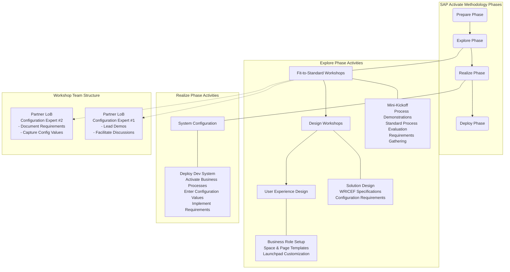

```mermaid
flowchart TB
    subgraph "SAP Activate Methodology Phases"
        Prepare("Prepare Phase")
        Explore("Explore Phase")
        Realize("Realize Phase")
        Deploy("Deploy Phase")
    end
    
    Prepare --> Explore
    Explore --> Realize
    Realize --> Deploy
    
    subgraph "Explore Phase Activities"
        fts["Fit-to-Standard Workshops"]
        fts_tasks["Mini-Kickoff
        Process Demonstrations
        Standard Process Evaluation
        Requirements Gathering"]
        
        design["Design Workshops"]
        design_tasks["Solution Design
        WRICEF Specifications
        Configuration Requirements"]
        
        ux["User Experience Design"]
        ux_tasks["Business Role Setup
        Space & Page Templates
        Launchpad Customization"]
    end
    
    Explore --- fts
    fts --- fts_tasks
    fts --> design
    design --- design_tasks
    design --> ux
    ux --- ux_tasks
    
    subgraph "Realize Phase Activities"
        config["System Configuration"]
        config_tasks["Deploy Dev System
        Activate Business Processes
        Enter Configuration Values
        Implement Requirements"]
    end
    
    Realize --- config
    config --- config_tasks
    
    subgraph "Workshop Team Structure"
        lead["Partner LoB 
        Configuration Expert #1
        - Lead Demos
        - Facilitate Discussions"]
        
        doc["Partner LoB
        Configuration Expert #2
        - Document Requirements
        - Capture Config Values"]
    end
    
    fts -.-> lead & doc
```
