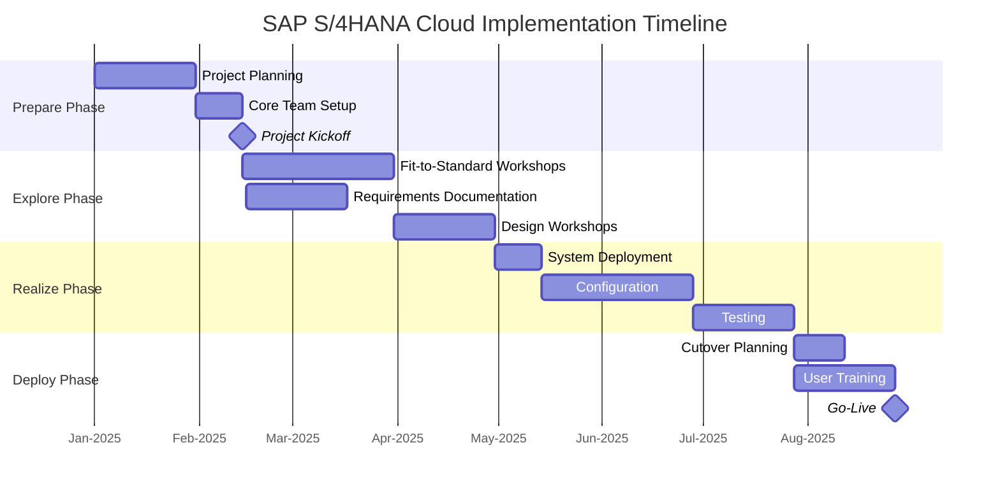

```mermaid
gantt
    title SAP S/4HANA Cloud Implementation Timeline
    dateFormat  YYYY-MM-DD
    axisFormat %b-%Y
    
    section Prepare Phase
    Project Planning           :a1, 2025-01-01, 30d
    Core Team Setup           :a2, after a1, 14d
    Project Kickoff           :milestone, a3, after a2, 0d
    
    section Explore Phase
    Fit-to-Standard Workshops :b1, after a3, 45d
    Requirements Documentation :b2, 2025-02-15, 30d
    Design Workshops          :b3, after b1, 30d
    
    section Realize Phase
    System Deployment         :c1, after b3, 14d
    Configuration             :c2, after c1, 45d
    Testing                   :c3, after c2, 30d
    
    section Deploy Phase
    Cutover Planning          :d1, after c3, 15d
    User Training             :d2, after c3, 30d
    Go-Live                   :milestone, d3, after d1 d2, 0d
```
