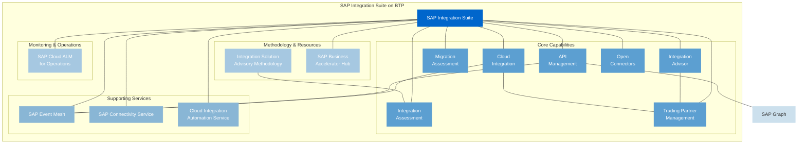

```mermaid
flowchart TB
    subgraph "SAP Integration Suite on BTP"
        MAIN[SAP Integration Suite]
        
        subgraph "Core Capabilities"
            IA[Integration\nAssessment]
            CI[Cloud\nIntegration]
            MA[Migration\nAssessment]
            IAdv[Integration\nAdvisor]
            TPM[Trading Partner\nManagement]
            APM[API\nManagement]
            OC[Open\nConnectors]
        end
        
        subgraph "Supporting Services"
            EM[SAP Event Mesh]
            CS[SAP Connectivity Service]
            CIAS[Cloud Integration\nAutomation Service]
        end
        
        subgraph "Methodology & Resources"
            ISAM[Integration Solution\nAdvisory Methodology]
            BAH[SAP Business\nAccelerator Hub]
        end
        
        subgraph "Monitoring & Operations"
            CALM[SAP Cloud ALM\nfor Operations]
        end
    end
    
    MAIN --- IA
    MAIN --- CI
    MAIN --- MA
    MAIN --- IAdv
    MAIN --- TPM
    MAIN --- APM
    MAIN --- OC
    
    APM --- SAPG[SAP Graph]
    
    ISAM --- IA
    IAdv --- TPM
    
    MAIN --- EM
    MAIN --- CS
    MAIN --- CIAS
    
    CI --- TPM
    CI --- EM
    
    APM --- EM
    
    MAIN --- BAH
    MAIN --- CALM
    
    classDef main fill:#0066cc,stroke:#0066cc,color:white,stroke-width:3px
    classDef core fill:#5c9fd1,stroke:#5c9fd1,color:white,stroke-width:2px
    classDef support fill:#89b6d5,stroke:#89b6d5,color:white
    classDef resources fill:#a6c8e1,stroke:#a6c8e1,color:white
    classDef subcomp fill:#cce0ed,stroke:#cce0ed,color:#333
    
    class MAIN main
    class IA,CI,MA,IAdv,TPM,APM,OC core
    class EM,CS,CIAS support
    class ISAM,BAH,CALM resources
    class SAPG subcomp
```
