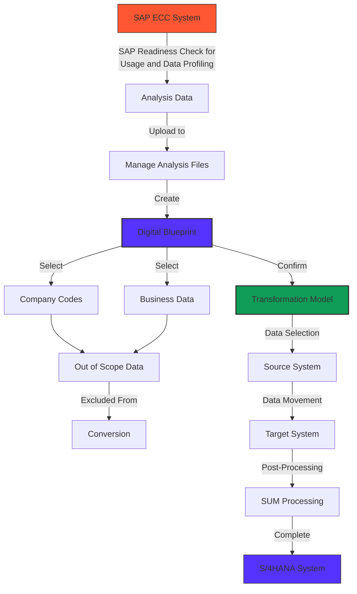

```mermaid
flowchart TD
    A[SAP ECC System] -->|"SAP Readiness Check for\nUsage and Data Profiling"| B[Analysis Data]
    B -->|"Upload to"| C[Manage Analysis Files]
    C -->|"Create"| D[Digital Blueprint]
    D -->|"Select"| E[Company Codes]
    D -->|"Select"| F[Business Data]
    E --> G[Out of Scope Data]
    F --> G
    G -->|"Excluded From"| H[Conversion]
    D -->|"Confirm"| I[Transformation Model]
    I -->|"Data Selection"| J[Source System]
    J -->|"Data Movement"| K[Target System]
    K -->|"Post-Processing"| L[SUM Processing]
    L -->|"Complete"| M[S/4HANA System]
    
    style A fill:#FF5733,stroke:#333,stroke-width:1px
    style M fill:#5733FF,stroke:#333,stroke-width:1px
    style D fill:#5733FF,stroke:#333,stroke-width:2px
    style I fill:#0F9D58,stroke:#333,stroke-width:2px
```
