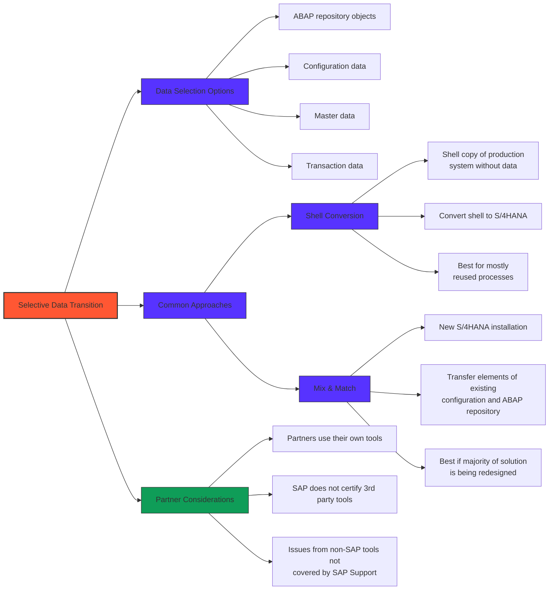

```mermaid
graph LR
    A[Selective Data Transition] --> B[Data Selection Options]
    B --> B1[ABAP repository objects]
    B --> B2[Configuration data]
    B --> B3[Master data]
    B --> B4[Transaction data]
    
    A --> C[Common Approaches]
    C --> D[Shell Conversion]
    C --> E[Mix & Match]
    
    D --> D1[Shell copy of production\nsystem without data]
    D --> D2[Convert shell to S/4HANA]
    D --> D3[Best for mostly\nreused processes]
    
    E --> E1[New S/4HANA installation]
    E --> E2[Transfer elements of existing\nconfiguration and ABAP repository]
    E --> E3[Best if majority of solution\nis being redesigned]
    
    A --> F[Partner Considerations]
    F --> F1[Partners use their own tools]
    F --> F2[SAP does not certify 3rd party tools]
    F --> F3[Issues from non-SAP tools not\ncovered by SAP Support]
    
    style A fill:#FF5733,stroke:#333,stroke-width:2px
    style B fill:#5733FF,stroke:#333
    style C fill:#5733FF,stroke:#333
    style D fill:#5733FF,stroke:#333
    style E fill:#5733FF,stroke:#333
    style F fill:#0F9D58,stroke:#333
```
