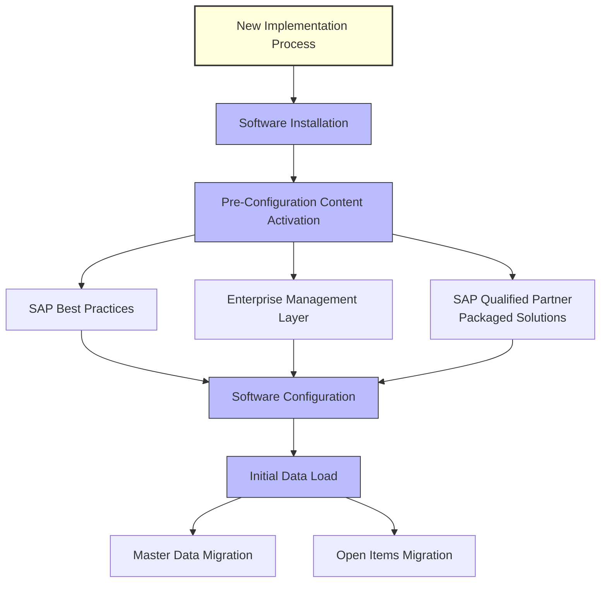

```mermaid
graph TD
    A[New Implementation Process] --> B[Software Installation]
    B --> C[Pre-Configuration Content Activation]
    C --> C1[SAP Best Practices]
    C --> C2[Enterprise Management Layer]
    C --> C3[SAP Qualified Partner\nPackaged Solutions]
    C1 --> D[Software Configuration]
    C2 --> D
    C3 --> D
    D --> E[Initial Data Load]
    E --> E1[Master Data Migration]
    E --> E2[Open Items Migration]
    
    style A fill:#ffffde,stroke:#333,stroke-width:2px
    style B fill:#bbf,stroke:#333
    style C fill:#bbf,stroke:#333
    style D fill:#bbf,stroke:#333
    style E fill:#bbf,stroke:#333
```
