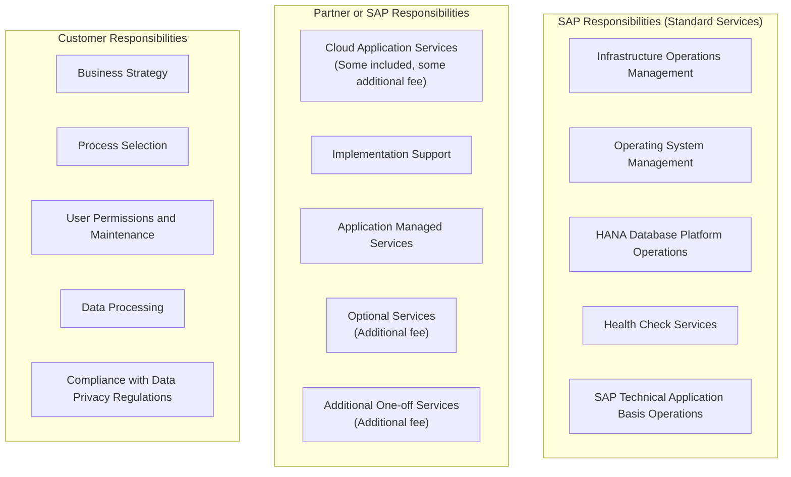

```mermaid
graph TD
    subgraph "SAP Responsibilities (Standard Services)"
        InfraOps["Infrastructure Operations Management"]
        OSMgmt["Operating System Management"]
        HANAOps["HANA Database Platform Operations"]
        HealthCheck["Health Check Services"]
        TechOps["SAP Technical Application Basis Operations"]
    end
    
    subgraph "Partner or SAP Responsibilities"
        CloudApp["Cloud Application Services\n(Some included, some additional fee)"]
        ImplServ["Implementation Support"]
        AppMgmt["Application Managed Services"]
        Optional["Optional Services\n(Additional fee)"]
        OneOff["Additional One-off Services\n(Additional fee)"]
    end
    
    subgraph "Customer Responsibilities"
        BizStrategy["Business Strategy"]
        ProcessSelection["Process Selection"]
        UserPerms["User Permissions and Maintenance"]
        DataProc["Data Processing"]
        Compliance["Compliance with Data Privacy Regulations"]
    end
```
