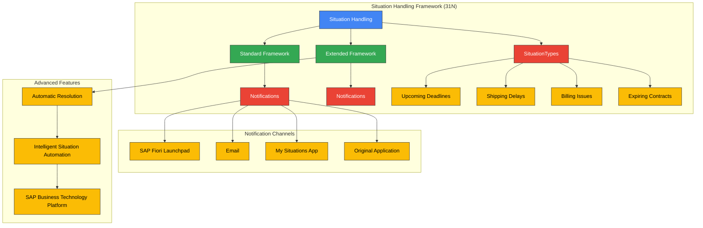

```mermaid
flowchart TB
    subgraph "Situation Handling Framework (31N)"
        SH[Situation Handling] --> SF[Standard Framework]
        SH --> EF[Extended Framework]
        
        SF --> N1[Notifications]
        EF --> N2[Notifications]
        
        SH --> SituationTypes
        
        SituationTypes --> ST1[Upcoming Deadlines]
        SituationTypes --> ST2[Shipping Delays]
        SituationTypes --> ST3[Billing Issues]
        SituationTypes --> ST4[Expiring Contracts]
    end
    
    subgraph "Notification Channels"
        N1 --> NC1[SAP Fiori Launchpad]
        N1 --> NC2[Email]
        N1 --> NC3[My Situations App]
        N1 --> NC4[Original Application]
    end
    
    subgraph "Advanced Features"
        EF --> AR[Automatic Resolution]
        AR --> ISA[Intelligent Situation Automation]
        ISA --> BTP[SAP Business Technology Platform]
    end
    
    classDef primary fill:#4285F4,stroke:#333,stroke-width:1px,color:white
    classDef secondary fill:#34A853,stroke:#333,stroke-width:1px,color:white
    classDef tertiary fill:#EA4335,stroke:#333,stroke-width:1px,color:white
    classDef quaternary fill:#FBBC05,stroke:#333,stroke-width:1px,color:black
    
    class SH primary
    class SF,EF secondary
    class SituationTypes,N1,N2 tertiary
    class ST1,ST2,ST3,ST4,NC1,NC2,NC3,NC4,AR,ISA,BTP quaternary
```
