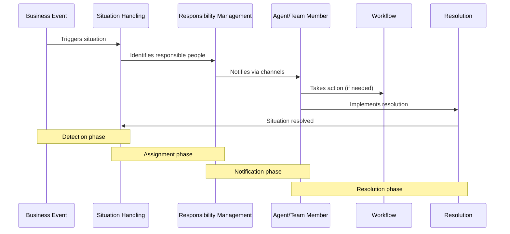

```mermaid
sequenceDiagram
    participant BE as Business Event
    participant SH as Situation Handling
    participant RM as Responsibility Management
    participant A as Agent/Team Member
    participant W as Workflow
    participant R as Resolution
    
    BE->>SH: Triggers situation
    SH->>RM: Identifies responsible people
    RM->>A: Notifies via channels
    A->>W: Takes action (if needed)
    A->>R: Implements resolution
    R->>SH: Situation resolved
    
    Note over BE,SH: Detection phase
    Note over SH,RM: Assignment phase
    Note over RM,A: Notification phase
    Note over A,R: Resolution phase
```
