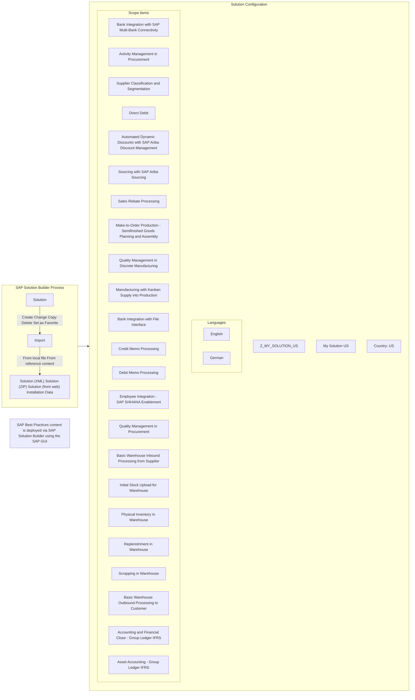

```mermaid
%% Diagram 3: SAP Solution Builder Process
flowchart LR
    subgraph SolutionMenu["SAP Solution Builder Process"]
        S1["Solution"]
        S1 -->|"Create Change Copy Delete Set as Favorite"| S2
        
        S2["Import"]
        S2 -->|"From local file From reference content"| S3
        
        S3["Solution (XML) Solution (ZIP) Solution (from web) Installation Data"]
    end
    
    subgraph SolutionConfig["Solution Configuration"]
        C1["Z_MY_SOLUTION_US"]
        C2["My Solution US"]
        C3["Country: US"]
        
        subgraph Languages
            L1["English"]
            L2["German"]
        end
        
        subgraph ScopeItems["Scope Items"]
            SI1["Bank Integration with SAP Multi-Bank Connectivity"]
            SI2["Activity Management in Procurement"]
            SI3["Supplier Classification and Segmentation"]
            SI4["Direct Debit"]
            SI5["Automated Dynamic Discounts with SAP Ariba Discount Management"]
            SI6["Sourcing with SAP Ariba Sourcing"]
            SI7["Sales Rebate Processing"]
            SI8["Make-to-Order Production - Semifinished Goods Planning and Assembly"]
            SI9["Quality Management in Discrete Manufacturing"]
            SI10["Manufacturing with Kanban Supply into Production"]
            SI11["Bank Integration with File Interface"]
            SI12["Credit Memo Processing"]
            SI13["Debit Memo Processing"]
            SI14["Employee Integration - SAP S/4HANA Enablement"]
            SI15["Quality Management in Procurement"]
            SI16["Basic Warehouse Inbound Processing from Supplier"]
            SI17["Initial Stock Upload for Warehouse"]
            SI18["Physical Inventory in Warehouse"]
            SI19["Replenishment in Warehouse"]
            SI20["Scrapping in Warehouse"]
            SI21["Basic Warehouse Outbound Processing to Customer"]
            SI22["Accounting and Financial Close - Group Ledger IFRS"]
            SI23["Asset Accounting - Group Ledger IFRS"]
        end
    end
    
    SolutionMenu --> SolutionConfig
    
    note2["SAP Best Practices content is deployed via SAP Solution Builder using the SAP GUI"]
```
