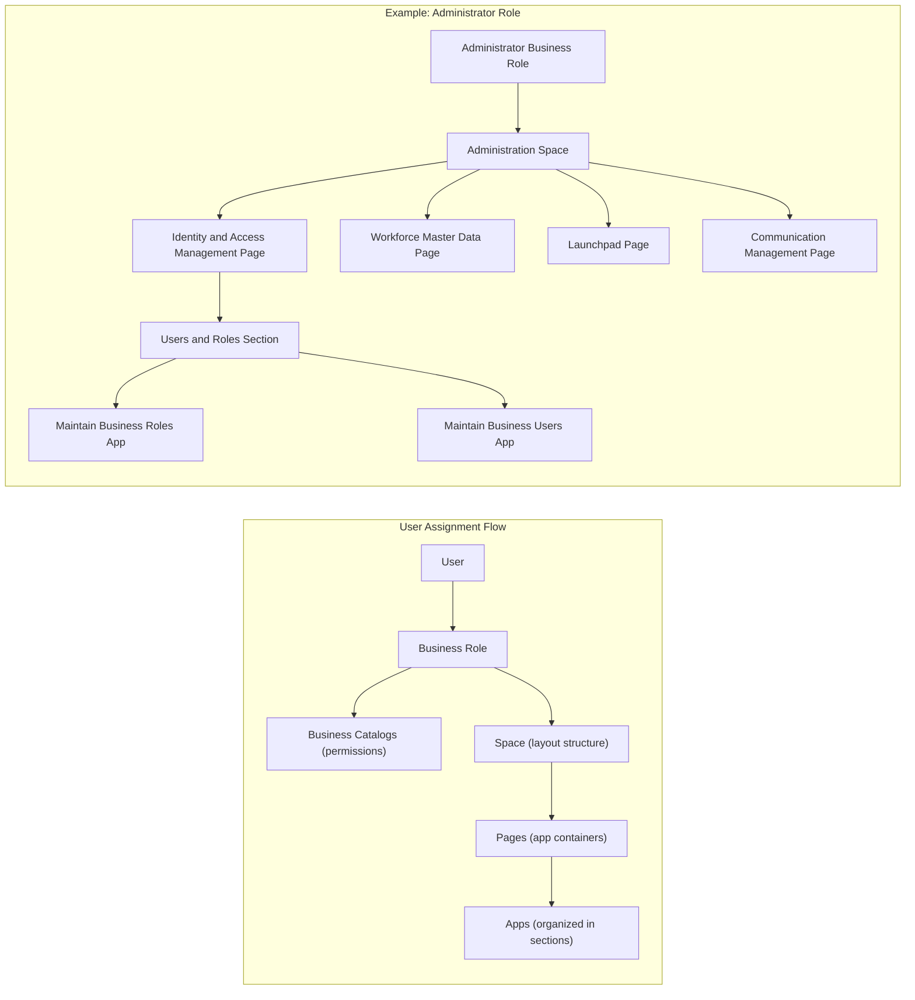

```mermaid
flowchart LR
    subgraph "User Assignment Flow"
        direction TB
        U[User] --> BR[Business Role]
        BR --> BC["Business Catalogs (permissions)"]
        BR --> S["Space (layout structure)"]
        S --> P["Pages (app containers)"]
        P --> A["Apps (organized in sections)"]
    end
    
    subgraph "Example: Administrator Role"
        direction TB
        AR["Administrator Business Role"] --> AS["Administration Space"]
        AS --> P1["Identity and Access Management Page"]
        AS --> P2["Workforce Master Data Page"]
        AS --> P3["Launchpad Page"]
        AS --> P4["Communication Management Page"]
        P1 --> UR["Users and Roles Section"]
        UR --> A1["Maintain Business Roles App"]
        UR --> A2["Maintain Business Users App"]
    end
```
