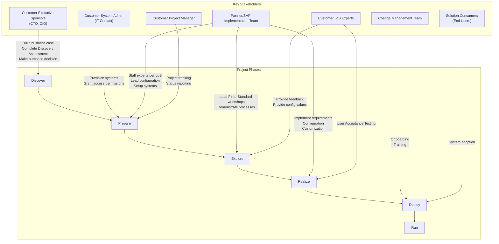

```mermaid
flowchart TD
    subgraph "Project Phases"
        Discover --> Prepare --> Explore --> Realize --> Deploy --> Run
    end
    
    subgraph "Key Stakeholders"
        Executive["Customer Executive Sponsors\n(CTO, CIO)"] 
        SysAdmin["Customer System Admin\n(IT Contact)"]
        PartnerTeam["Partner/SAP Implementation Team"]
        CustomerPM["Customer Project Manager"]
        LoBExperts["Customer LoB Experts"]
        ChangeTeam["Change Management Team"]
        Consumers["Solution Consumers\n(End Users)"]
    end
    
    Executive -- "Build business case\nComplete Discovery Assessment\nMake purchase decision" --> Discover
    SysAdmin -- "Provision systems\nGrant access permissions" --> Prepare
    PartnerTeam -- "Staff experts per LoB\nLead configuration\nSetup systems" --> Prepare
    CustomerPM -- "Project tracking\nStatus reporting" --> Prepare
    
    PartnerTeam -- "Lead Fit-to-Standard workshops\nDemonstrate processes" --> Explore
    LoBExperts -- "Provide feedback\nProvide config values" --> Explore
    
    PartnerTeam -- "Implement requirements\nConfiguration\nCustomization" --> Realize
    LoBExperts -- "User Acceptance Testing" --> Realize
    
    ChangeTeam -- "Onboarding\nTraining" --> Deploy
    Consumers -- "System adoption" --> Deploy
```
