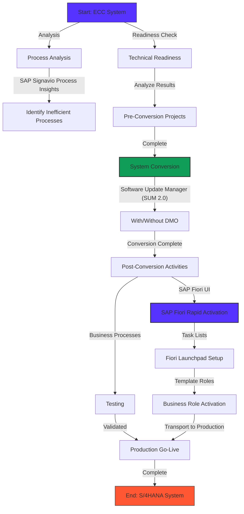

```mermaid
flowchart TD
    A[Start: ECC System] -->|Analysis| B[Process Analysis]
    B -->|"SAP Signavio Process Insights"| C[Identify Inefficient Processes]
    
    A -->|Readiness Check| D[Technical Readiness]
    D -->|"Analyze Results"| E[Pre-Conversion Projects]
    
    E -->|Complete| F[System Conversion]
    F -->|"Software Update Manager (SUM 2.0)"| G[With/Without DMO]
    G -->|"Conversion Complete"| H[Post-Conversion Activities]
    
    H -->|"SAP Fiori UI"| I[SAP Fiori Rapid Activation]
    H -->|"Business Processes"| J[Testing]
    
    I -->|"Task Lists"| K[Fiori Launchpad Setup]
    K -->|"Template Roles"| L[Business Role Activation]
    
    J -->|"Validated"| M[Production Go-Live]
    L -->|"Transport to Production"| M
    
    M -->|"Complete"| N[End: S/4HANA System]
    
    style A fill:#5733FF,stroke:#333,stroke-width:1px
    style N fill:#FF5733,stroke:#333,stroke-width:1px
    style F fill:#0F9D58,stroke:#333,stroke-width:2px
    style I fill:#5733FF,stroke:#333,stroke-width:2px
```
