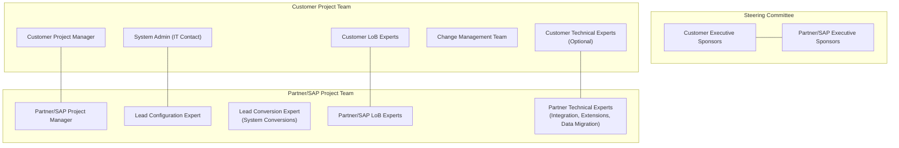

```mermaid
flowchart TD
    subgraph "Steering Committee"
        CustomerExec["Customer Executive Sponsors"]
        PartnerExec["Partner/SAP Executive Sponsors"]
    end
    
    subgraph "Customer Project Team"
        CustomerPM["Customer Project Manager"]
        SysAdmin["System Admin (IT Contact)"]
        CustomerLoBExperts["Customer LoB Experts"]
        ChangeTeam["Change Management Team"]
        CustomerTech["Customer Technical Experts\n(Optional)"]
    end
    
    subgraph "Partner/SAP Project Team"
        PartnerPM["Partner/SAP Project Manager"]
        ConfigExpert["Lead Configuration Expert"]
        ConversionExpert["Lead Conversion Expert\n(System Conversions)"]
        PartnerLoBExperts["Partner/SAP LoB Experts"]
        PartnerTech["Partner Technical Experts\n(Integration, Extensions, Data Migration)"]
    end
    
    CustomerExec --- PartnerExec
    CustomerPM --- PartnerPM
    SysAdmin --- ConfigExpert
    CustomerLoBExperts --- PartnerLoBExperts
    CustomerTech --- PartnerTech
```
