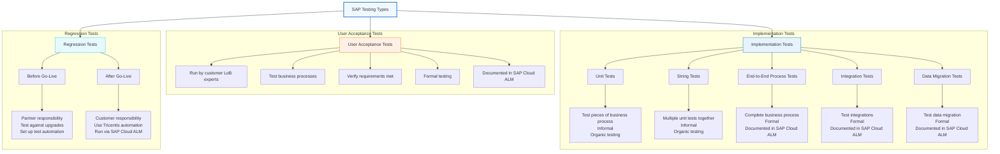

```mermaid
flowchart TD
    A[SAP Testing Types] --> B[Implementation Tests]
    A --> C[User Acceptance Tests]
    A --> D[Regression Tests]
    
    subgraph "Implementation Tests"
        B --> B1[Unit Tests]
        B --> B2[String Tests]
        B --> B3[End-to-End Process Tests]
        B --> B4[Integration Tests]
        B --> B5[Data Migration Tests]
        
        B1 --> B1a["Test pieces of business process\nInformal\nOrganic testing"]
        B2 --> B2a["Multiple unit tests together\nInformal\nOrganic testing"]
        B3 --> B3a["Complete business process\nFormal\nDocumented in SAP Cloud ALM"]
        B4 --> B4a["Test integrations\nFormal\nDocumented in SAP Cloud ALM"]
        B5 --> B5a["Test data migration\nFormal\nDocumented in SAP Cloud ALM"]
    end
    
    subgraph "User Acceptance Tests"
        C --> C1["Run by customer LoB experts"]
        C --> C2["Test business processes"]
        C --> C3["Verify requirements met"]
        C --> C4["Formal testing"]
        C --> C5["Documented in SAP Cloud ALM"]
    end
    
    subgraph "Regression Tests"
        D --> D1[Before Go-Live]
        D --> D2[After Go-Live]
        
        D1 --> D1a["Partner responsibility\nTest against upgrades\nSet up test automation"]
        D2 --> D2a["Customer responsibility\nUse Tricentis automation\nRun via SAP Cloud ALM"]
    end
    
    style A fill:#f0f8ff,stroke:#0066cc,stroke-width:2px
    style B fill:#e6f3ff,stroke:#0066cc,stroke-width:1px
    style C fill:#fff0e6,stroke:#ff6600,stroke-width:1px
    style D fill:#e6f9ff,stroke:#00ccff,stroke-width:1px
```
