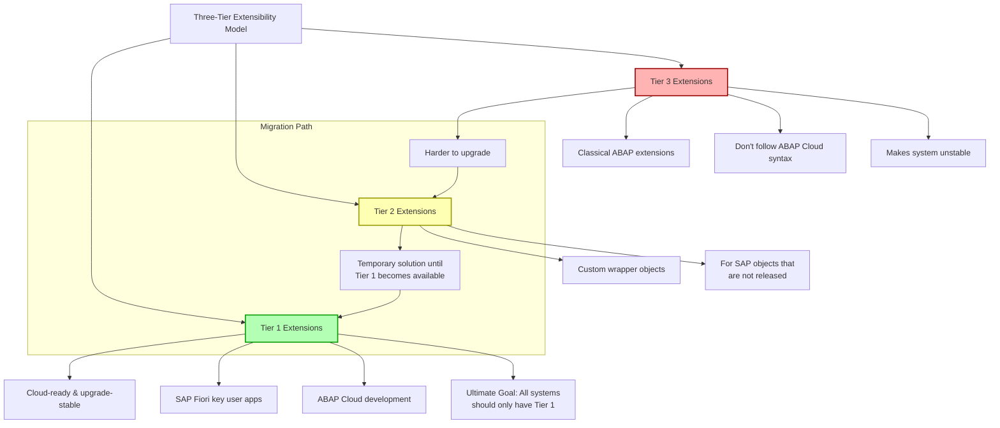

```mermaid
flowchart TD
    A[Three-Tier Extensibility Model] --> B[Tier 1 Extensions]
    A --> C[Tier 2 Extensions]
    A --> D[Tier 3 Extensions]
    
    B --> B1[Cloud-ready & upgrade-stable]
    B --> B2[SAP Fiori key user apps]
    B --> B3[ABAP Cloud development]
    B --> B4["Ultimate Goal: All systems\nshould only have Tier 1"]
    
    C --> C1[Custom wrapper objects]
    C --> C2[For SAP objects that\nare not released]
    C --> C3[Temporary solution until\nTier 1 becomes available]
    
    D --> D1[Classical ABAP extensions]
    D --> D2[Don't follow ABAP Cloud syntax]
    D --> D3[Makes system unstable]
    D --> D4[Harder to upgrade]
    
    subgraph "Migration Path"
    D4 --> C
    C3 --> B
    end
    
    style B fill:#b3ffb3,stroke:#009900,stroke-width:2px
    style C fill:#ffffb3,stroke:#999900,stroke-width:2px
    style D fill:#ffb3b3,stroke:#990000,stroke-width:2px
```
