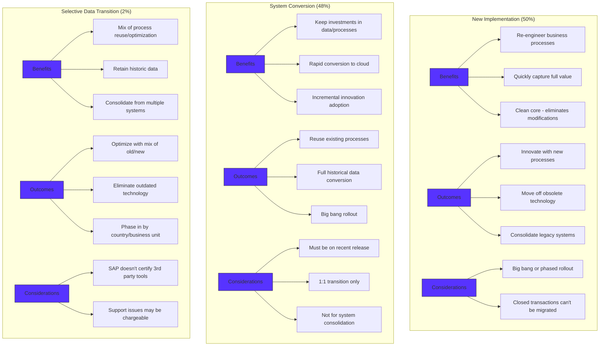

```mermaid
graph TB
    subgraph "New Implementation (50%)"
        NI1[Benefits]
        NI1 --> NI1a[Re-engineer business processes]
        NI1 --> NI1b[Quickly capture full value]
        NI1 --> NI1c[Clean core - eliminates modifications]
        
        NI2[Outcomes]
        NI2 --> NI2a[Innovate with new processes]
        NI2 --> NI2b[Move off obsolete technology]
        NI2 --> NI2c[Consolidate legacy systems]
        
        NI3[Considerations]
        NI3 --> NI3a[Big bang or phased rollout]
        NI3 --> NI3b[Closed transactions can't be migrated]
    end
    
    subgraph "System Conversion (48%)"
        SC1[Benefits]
        SC1 --> SC1a[Keep investments in data/processes]
        SC1 --> SC1b[Rapid conversion to cloud]
        SC1 --> SC1c[Incremental innovation adoption]
        
        SC2[Outcomes]
        SC2 --> SC2a[Reuse existing processes]
        SC2 --> SC2b[Full historical data conversion]
        SC2 --> SC2c[Big bang rollout]
        
        SC3[Considerations]
        SC3 --> SC3a[Must be on recent release]
        SC3 --> SC3b[1:1 transition only]
        SC3 --> SC3c[Not for system consolidation]
    end
    
    subgraph "Selective Data Transition (2%)"
        SD1[Benefits]
        SD1 --> SD1a[Mix of process reuse/optimization]
        SD1 --> SD1b[Retain historic data]
        SD1 --> SD1c[Consolidate from multiple systems]
        
        SD2[Outcomes]
        SD2 --> SD2a[Optimize with mix of old/new]
        SD2 --> SD2b[Eliminate outdated technology]
        SD2 --> SD2c[Phase in by country/business unit]
        
        SD3[Considerations]
        SD3 --> SD3a[SAP doesn't certify 3rd party tools]
        SD3 --> SD3b[Support issues may be chargeable]
    end
    
    style NI1 fill:#5733FF,stroke:#333
    style NI2 fill:#5733FF,stroke:#333
    style NI3 fill:#5733FF,stroke:#333
    style SC1 fill:#5733FF,stroke:#333
    style SC2 fill:#5733FF,stroke:#333
    style SC3 fill:#5733FF,stroke:#333
    style SD1 fill:#5733FF,stroke:#333
    style SD2 fill:#5733FF,stroke:#333
    style SD3 fill:#5733FF,stroke:#333
```
