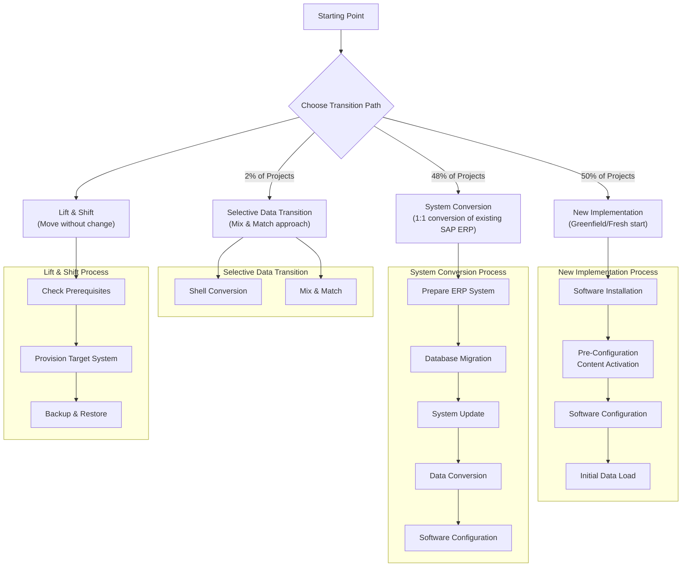

```mermaid
flowchart TD
    start["Starting Point"] --> decision{"Choose Transition Path"}
    
    decision -->|"48% of Projects"| sc["System Conversion<br/>(1:1 conversion of existing SAP ERP)"]
    decision -->|"50% of Projects"| ni["New Implementation<br/>(Greenfield/Fresh start)"]
    decision -->|"2% of Projects"| sdt["Selective Data Transition<br/>(Mix & Match approach)"]
    decision --> ls["Lift & Shift<br/>(Move without change)"]
    
    subgraph "New Implementation Process"
        ni1["Software Installation"]
        ni2["Pre-Configuration<br/>Content Activation"]
        ni3["Software Configuration"]
        ni4["Initial Data Load"]
    end
    
    ni --> ni1 --> ni2 --> ni3 --> ni4
    
    subgraph "System Conversion Process"
        sc1["Prepare ERP System"]
        sc2["Database Migration"]
        sc3["System Update"]
        sc4["Data Conversion"]
        sc5["Software Configuration"]
    end
    
    sc --> sc1 --> sc2 --> sc3 --> sc4 --> sc5
    
    subgraph "Selective Data Transition"
        sdt1["Shell Conversion"] 
        sdt2["Mix & Match"]
    end
    
    sdt --> sdt1
    sdt --> sdt2
    
    subgraph "Lift & Shift Process"
        ls1["Check Prerequisites"]
        ls2["Provision Target System"]
        ls3["Backup & Restore"]
    end
    
    ls --> ls1 --> ls2 --> ls3
```
