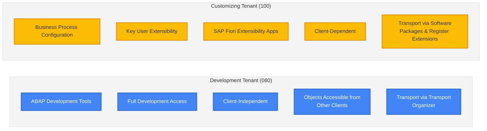

```mermaid
graph LR
    subgraph DEV["Development Tenant (080)"]
        D1["ABAP Development Tools"]
        D2["Full Development Access"]
        D3["Client-Independent"]
        D4["Objects Accessible from\nOther Clients"]
        D5["Transport via Transport\nOrganizer"]
    end
    
    subgraph CUS["Customizing Tenant (100)"]
        C1["Business Process Configuration"]
        C2["Key User Extensibility"]
        C3["SAP Fiori Extensibility Apps"]
        C4["Client-Dependent"]
        C5["Transport via Software\nPackages & Register Extensions"]
    end
    
    classDef dev fill:#4285F4,color:white,stroke:#2A67D4,stroke-width:2px
    classDef cust fill:#FBBC04,color:#333,stroke:#EA8600,stroke-width:2px
    classDef container fill:#F1F3F4,stroke:#DADCE0,stroke-width:1px
    
    class D1,D2,D3,D4,D5 dev
    class C1,C2,C3,C4,C5 cust
    class DEV,CUS container
```
