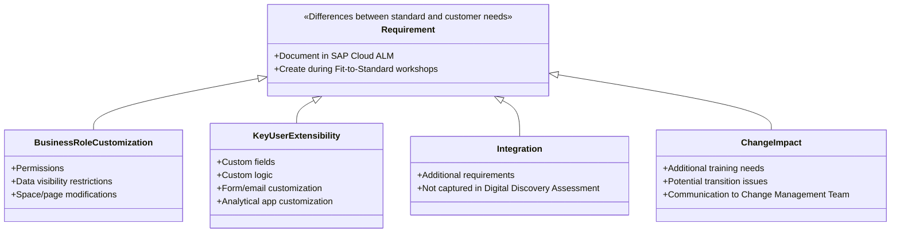

```mermaid
classDiagram
    class Requirement {
        <<Differences between standard and customer needs>>
        +Document in SAP Cloud ALM
        +Create during Fit-to-Standard workshops
    }
    
    Requirement <|-- BusinessRoleCustomization
    Requirement <|-- KeyUserExtensibility
    Requirement <|-- Integration
    Requirement <|-- ChangeImpact
    
    class BusinessRoleCustomization {
        +Permissions
        +Data visibility restrictions
        +Space/page modifications
    }
    
    class KeyUserExtensibility {
        +Custom fields
        +Custom logic
        +Form/email customization
        +Analytical app customization
    }
    
    class Integration {
        +Additional requirements
        +Not captured in Digital Discovery Assessment
    }
    
    class ChangeImpact {
        +Additional training needs
        +Potential transition issues
        +Communication to Change Management Team
    }
```
