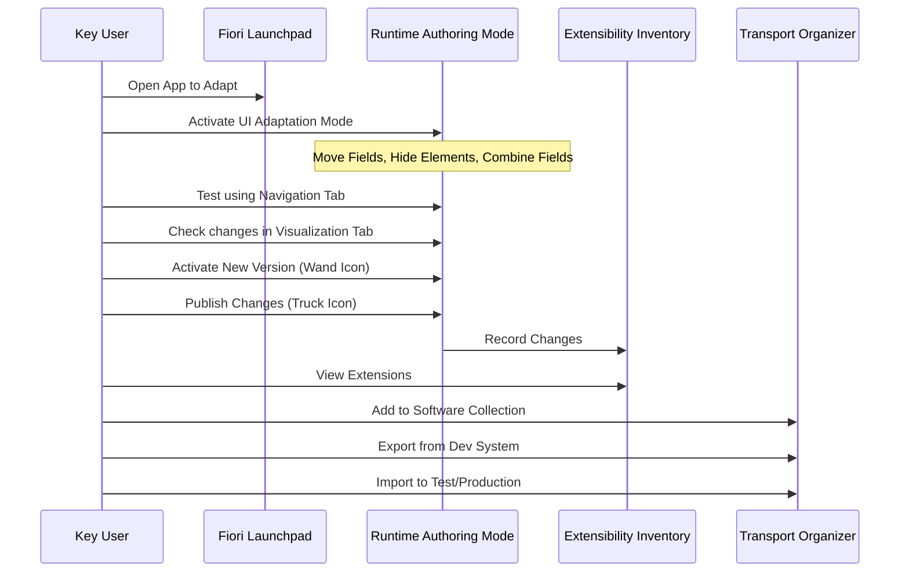

```mermaid
sequenceDiagram
    participant KU as Key User
    participant FL as Fiori Launchpad
    participant RA as Runtime Authoring Mode
    participant EI as Extensibility Inventory
    participant TO as Transport Organizer
    
    KU->>FL: Open App to Adapt
    KU->>RA: Activate UI Adaptation Mode
    Note over RA: Move Fields, Hide Elements, Combine Fields
    KU->>RA: Test using Navigation Tab
    KU->>RA: Check changes in Visualization Tab
    KU->>RA: Activate New Version (Wand Icon)
    KU->>RA: Publish Changes (Truck Icon)
    RA->>EI: Record Changes
    KU->>EI: View Extensions
    KU->>TO: Add to Software Collection
    KU->>TO: Export from Dev System
    KU->>TO: Import to Test/Production
```
