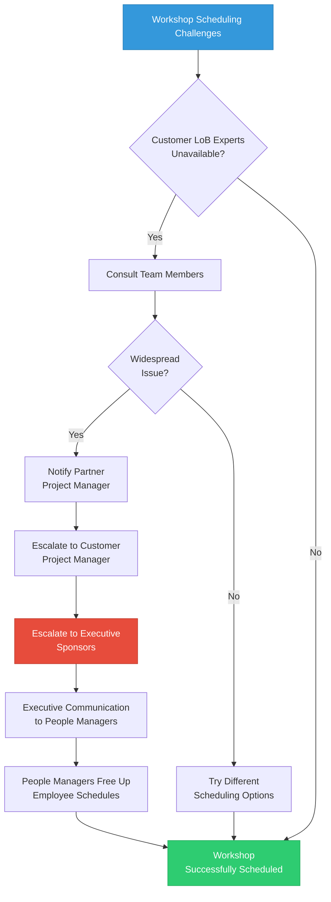

```mermaid
flowchart TD
    A[Workshop Scheduling Challenges] --> B{Customer LoB Experts\nUnavailable?}
    B -->|Yes| C[Consult Team Members]
    C --> D{Widespread\nIssue?}
    D -->|Yes| E[Notify Partner\nProject Manager]
    E --> F[Escalate to Customer\nProject Manager]
    F --> G[Escalate to Executive\nSponsors]
    G --> H[Executive Communication\nto People Managers]
    H --> I[People Managers Free Up\nEmployee Schedules]
    I --> J[Workshop\nSuccessfully Scheduled]
    
    D -->|No| K[Try Different\nScheduling Options]
    K --> J
    
    B -->|No| J
    
    style A fill:#3498db,stroke:#2980b9,color:white
    style J fill:#2ecc71,stroke:#27ae60,color:white
    style G fill:#e74c3c,stroke:#c0392b,color:white
```
